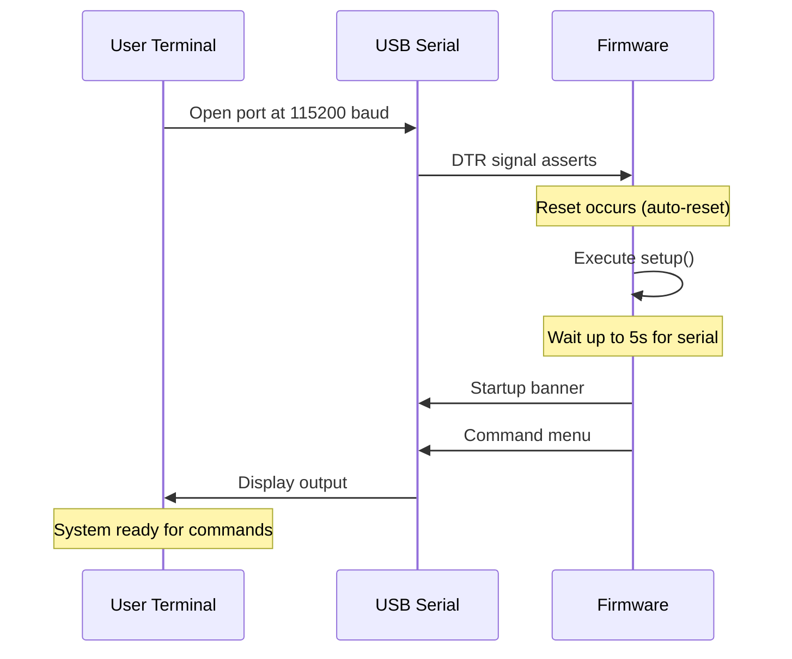
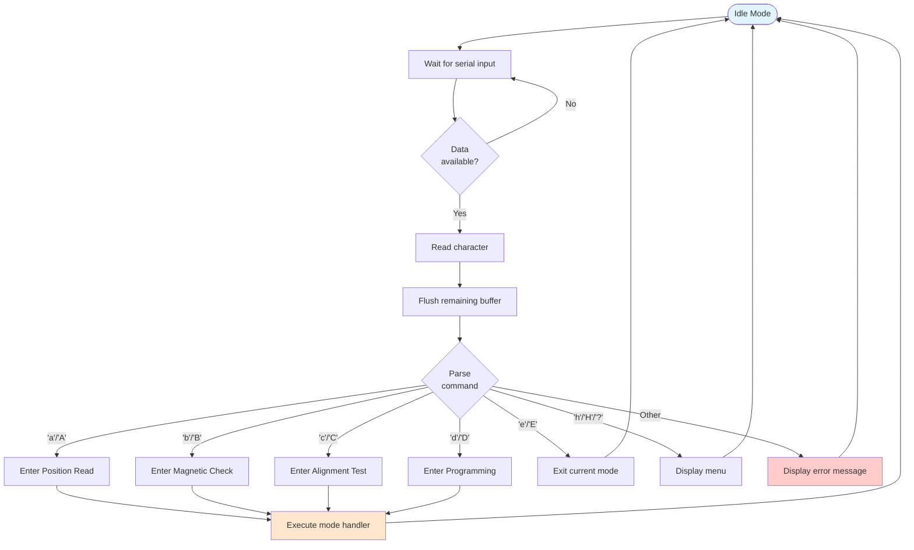
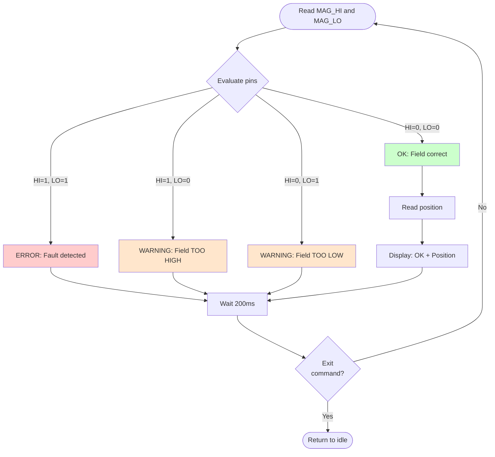
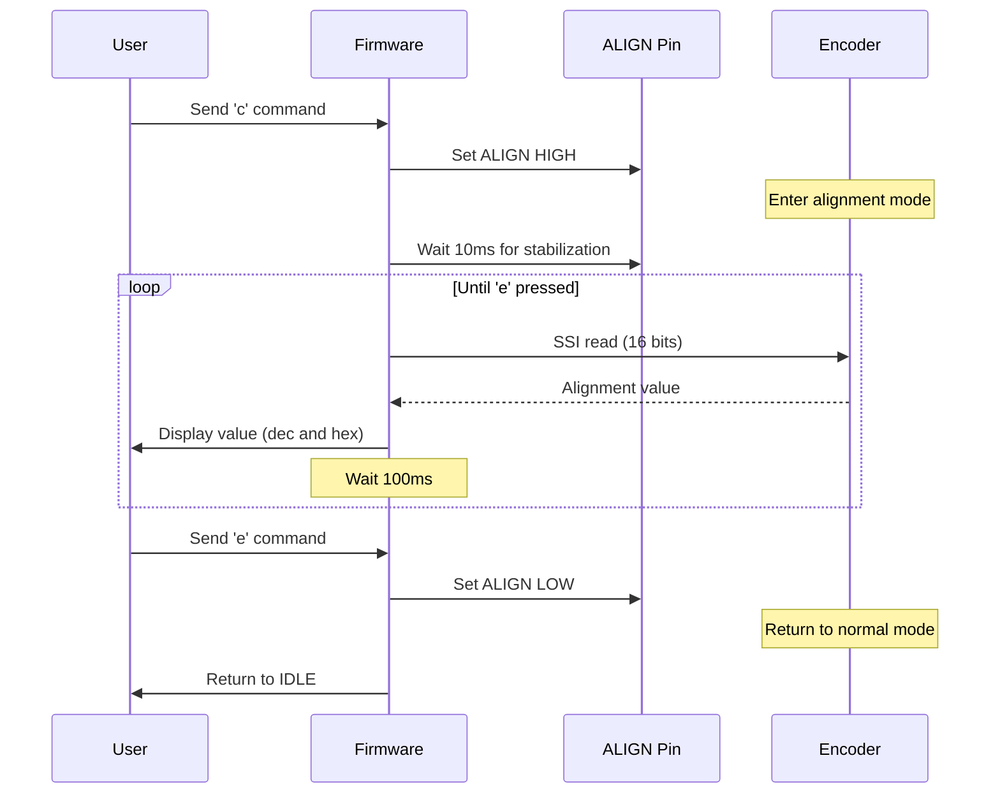
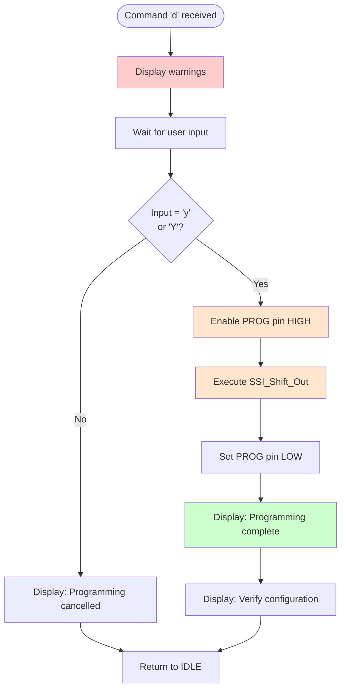
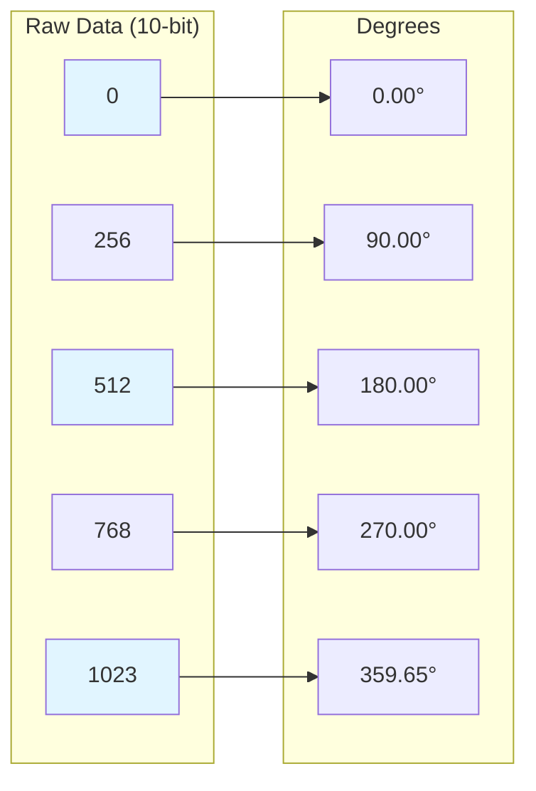

# API Reference

## Table of Contents
- [Overview](#overview)
- [Serial Communication](#serial-communication)
- [Command Interface](#command-interface)
- [Operational Modes](#operational-modes)
- [Function Reference](#function-reference)
- [Data Formats](#data-formats)
- [Error Codes and Messages](#error-codes-and-messages)
- [Usage Examples](#usage-examples)

## Overview

The AEAT-6600-T16 Encoder Interface provides a simple command-line interface over USB serial communication. Commands are single-character controls that switch between operational modes.

### Quick Reference

| Command | Mode | Description |
|---------|------|-------------|
| `a` or `A` | Position Read | Continuous angular position output |
| `b` or `B` | Magnetic Check | Magnetic field strength monitoring |
| `c` or `C` | Alignment Test | Alignment quality measurement |
| `d` or `D` | Programming | OTP memory configuration (DANGEROUS) |
| `e` or `E` | Exit | Return to idle mode |
| `h` or `H` or `?` | Help | Display command menu |

## Serial Communication

### Connection Parameters

```
Baud Rate:     115200
Data Bits:     8
Parity:        None
Stop Bits:     1
Flow Control:  None
```

### Establishing Connection



### Expected Startup Output

```
========================================
AEAT-6600-T16 Encoder Interface v2.0.0
========================================

Available Commands:
  a - Position Read Mode (continuous angular position)
  b - Magnetic Field Check (verify magnet positioning)
  c - Alignment Test Mode (check magnetic alignment)
  d - Programming Mode (write encoder configuration)
  e - Exit current mode
  h - Show this menu

Enter a command:
```

## Command Interface

### Command Processing Flow



### Command Input Handling

- **Case Insensitive**: Commands accept both uppercase and lowercase
- **Buffer Flushing**: Residual input is cleared after command processing
- **No Echo**: Characters are not echoed back (depends on terminal settings)
- **Single Character**: Only first character is processed
- **No Command Queue**: Commands are processed one at a time

## Operational Modes

### Mode: Position Read (`a`)

**Description**: Continuously reads and displays the encoder's angular position.

**Entry Sequence**:
```
User Input: a
Output:
>>> Entering Position Read Mode
>>> Press 'e' to exit
Position: 0.00°
Position: 15.23°
Position: 45.67°
...
```

**Update Rate**: Every 10ms (100 Hz)

**Output Format**:
```
Position: <value>°
```
Where `<value>` is a floating-point number with 2 decimal places (0.00 to 359.99)

**Exit**: Send `e` or `E`

**Behavior Diagram**:
```mermaid
stateDiagram-v2
    [*] --> Initialize: Command 'a' received
    Initialize --> Reading: Start continuous loop

    Reading --> CheckExit: Check for 'e' command
    CheckExit --> Reading: Not 'e' - continue
    CheckExit --> Exit: 'e' received

    Reading --> SSIRead: Read encoder via SSI
    SSIRead --> Scale: Convert to degrees
    Scale --> Display: Output to serial
    Display --> Delay: Wait 10ms
    Delay --> CheckExit

    Exit --> [*]: Return to idle
```

**Example Session**:
```
> a
>>> Entering Position Read Mode
>>> Press 'e' to exit
Position: 0.00°
Position: 0.35°
Position: 1.41°
Position: 5.27°
...
Position: 354.12°
Position: 359.65°
Position: 0.18°
> e
>>> Returned to IDLE mode
```

---

### Mode: Magnetic Field Check (`b`)

**Description**: Monitors magnetic field strength via MAG_HI and MAG_LO status pins.

**Entry Sequence**:
```
User Input: b
Output:
>>> Entering Magnetic Field Check Mode
>>> Press 'e' to exit
```

**Update Rate**: Every 200ms (5 Hz)

**Possible Outputs**:

| Output | Meaning | MAG_HI | MAG_LO | Recommended Action |
|--------|---------|--------|--------|--------------------|
| `OK: Magnetic field intensity is correct. Position: XXX°` | Field is within range | 0 | 0 | None - ready to use |
| `WARNING: Magnetic field intensity is TOO HIGH` | Magnet too close | 1 | 0 | Increase air gap |
| `WARNING: Magnetic field intensity is TOO LOW` | Magnet too far | 0 | 1 | Decrease air gap |
| `ERROR: Fault detected (both MAG_HI and MAG_LO active)` | Hardware fault | 1 | 1 | Check wiring/encoder |

**Decision Tree**:


**Example Session**:
```
> b
>>> Entering Magnetic Field Check Mode
>>> Press 'e' to exit
WARNING: Magnetic field intensity is TOO LOW
WARNING: Magnetic field intensity is TOO LOW
OK: Magnetic field intensity is correct. Position: 45.23°
OK: Magnetic field intensity is correct. Position: 45.67°
OK: Magnetic field intensity is correct. Position: 46.02°
> e
>>> Returned to IDLE mode
```

---

### Mode: Alignment Test (`c`)

**Description**: Enables the encoder's alignment mode and displays the alignment quality value.

**Entry Sequence**:
```
User Input: c
Output:
>>> Entering Alignment Test Mode
>>> Press 'e' to exit
```

**Update Rate**: Every 100ms (10 Hz)

**Output Format**:
```
Alignment Value: <decimal> (0x<hexadecimal>)
```

**Value Interpretation**:
- **16-bit value** (0 to 65535)
- Lower values generally indicate better alignment
- Consult encoder datasheet for specific thresholds
- Typical good values: < 1000 (varies by magnet and airgap)

**Mode Operation**:


**Example Session**:
```
> c
>>> Entering Alignment Test Mode
>>> Press 'e' to exit
Alignment Value: 450 (0x1C2)
Alignment Value: 448 (0x1C0)
Alignment Value: 451 (0x1C3)
Alignment Value: 449 (0x1C1)
> e
>>> Returned to IDLE mode
```

---

### Mode: Programming (`d`)

**Description**: Writes configuration data to the encoder's OTP (One-Time Programmable) memory.

⚠️ **DANGER**: This operation is **PERMANENT and IRREVERSIBLE**. Use with extreme caution.

**Entry Sequence**:
```
User Input: d
Output:
>>> Entering Programming Mode
>>> WARNING: This mode writes to encoder OTP memory
========================================
WARNING: PROGRAMMING MODE
========================================
This mode writes to OTP memory!
Send 'y' to confirm, any other key to cancel
```

**Confirmation Flow**:


**Default Programming Data**:
```cpp
uint32_t programmingData = 0b00000000000000000100101100000111;
// Hex: 0x00012B07
```

**Output Example** (if confirmed):
```
Programming data: 0x12B07
Writing to encoder...
Programming complete.
Verify encoder configuration before using.

>>> Returned to IDLE mode
```

**Output Example** (if cancelled):
```
Programming cancelled.

>>> Returned to IDLE mode
```

**⚠️ CRITICAL WARNINGS**:
1. **OTP writes are permanent** - Cannot be undone
2. **Verify data carefully** - Incorrect configuration may render encoder unusable
3. **Consult datasheet** - Understand bit meanings before programming
4. **Test on spare unit** - If possible, test configuration on non-critical encoder first
5. **Current implementation** - Uses example data; modify in firmware before use

---

### Command: Exit Mode (`e`)

**Description**: Exits the current operational mode and returns to idle state.

**Behavior**:
- Stops continuous operations (position reading, monitoring, etc.)
- Resets all control pins (ALIGN, PROG, PWRDN) to LOW
- Clears serial buffers
- Displays menu

**Available In**: All operational modes

**Output**:
```
>>> Returned to IDLE mode

Available Commands:
  a - Position Read Mode
  ...
```

---

### Command: Help (`h`, `H`, or `?`)

**Description**: Displays the command menu.

**Output**:
```
Available Commands:
  a - Position Read Mode (continuous angular position)
  b - Magnetic Field Check (verify magnet positioning)
  c - Alignment Test Mode (check magnetic alignment)
  d - Programming Mode (write encoder configuration)
  e - Exit current mode
  h - Show this menu

Enter a command:
```

## Function Reference

### Core API Functions

#### `readPosition()`

```cpp
float readPosition();
```

**Description**: Reads the encoder's angular position.

**Returns**: Position in degrees (0.00 to 359.99)

**Resolution**: 10-bit (1024 positions per revolution, ~0.35° per step)

**Timing**:
- SSI transfer: ~35 µs
- Minimum time between calls: 60 µs (includes idle period)
- Maximum sample rate: ~17 kHz

**Example**:
```cpp
float angle = readPosition();
Serial.print("Current angle: ");
Serial.println(angle, 2);  // Print with 2 decimal places
```

---

#### `readAlignmentValue()`

```cpp
uint16_t readAlignmentValue();
```

**Description**: Reads the 16-bit alignment quality value.

**Precondition**: ALIGN pin must be HIGH

**Returns**: 16-bit alignment value (0 to 65535)

**Interpretation**: Lower values typically indicate better alignment (consult datasheet)

**Example**:
```cpp
digitalWrite(HardwareConfig::ALIGN, HIGH);
delay(10);  // Allow mode to stabilize
uint16_t alignment = readAlignmentValue();
Serial.print("Alignment: ");
Serial.println(alignment);
digitalWrite(HardwareConfig::ALIGN, LOW);
```

---

#### `checkMagneticField()`

```cpp
bool checkMagneticField(bool& isHigh, bool& isLow);
```

**Description**: Checks magnetic field strength status.

**Parameters**:
- `isHigh` (out): Set to `true` if field is too strong
- `isLow` (out): Set to `true` if field is too weak

**Returns**: `true` if field is within acceptable range, `false` otherwise

**Example**:
```cpp
bool isHigh, isLow;
bool isGood = checkMagneticField(isHigh, isLow);

if (isHigh && isLow) {
    Serial.println("Hardware fault!");
} else if (isHigh) {
    Serial.println("Field too high");
} else if (isLow) {
    Serial.println("Field too low");
} else {
    Serial.println("Field OK");
}
```

---

### Low-Level SSI Functions

#### `SSI_Shift_In()`

```cpp
unsigned long SSI_Shift_In(const uint8_t data_pin,
                           const uint8_t clock_pin,
                           const uint8_t bit_count);
```

**Description**: Reads data from encoder via SSI protocol using direct port manipulation.

**Parameters**:
- `data_pin`: GPIO pin number for data line (typically 7)
- `clock_pin`: GPIO pin number for clock line (typically 6)
- `bit_count`: Number of bits to read (typically 10 or 16)

**Returns**: Received data as unsigned long

**Timing**:
- Clock frequency: ~400 kHz
- Transfer time: ~(4 + 3*bit_count) µs

**Hardware Dependencies**:
- Assumes `data_pin` is on **PORTE bit 6**
- Assumes `clock_pin` is on **PORTD bit 7**
- Porting to other pins requires code modification

**Example**:
```cpp
// Read 10-bit position
unsigned long rawPosition = SSI_Shift_In(7, 6, 10);
uint16_t position = rawPosition & 0x03FF;  // Mask to 10 bits
```

---

#### `SSI_Shift_Out()`

```cpp
void SSI_Shift_Out(const uint8_t bit_count, uint32_t progData);
```

**Description**: Writes data to encoder via SSI protocol for programming.

**Parameters**:
- `bit_count`: Number of data bits to write (typically 32)
- `progData`: Data to write

**Precondition**: PROG pin must be HIGH

**Behavior**:
- Temporarily switches data pin to OUTPUT mode
- Writes start bit (1), data bits, stop bit (1)
- Restores data pin to INPUT mode

**Example**:
```cpp
digitalWrite(HardwareConfig::PROG, HIGH);
delay(10);

uint32_t config = 0x00012B07;
SSI_Shift_Out(32, config);

digitalWrite(HardwareConfig::PROG, LOW);
```

---

### Utility Functions

#### `printMenu()`

```cpp
void printMenu();
```

**Description**: Prints the command menu to serial console.

**Output**: List of available commands with descriptions.

---

#### `flushSerialInput()`

```cpp
void flushSerialInput();
```

**Description**: Discards all pending data in serial input buffer.

**Use Case**: Prevents command overlap and ensures clean state transitions.

## Data Formats

### Position Data

**Format**: Floating-point degrees

**Range**: 0.00° to 359.99°

**Resolution**: 0.35° (360° / 1024 positions)

**Precision**: 2 decimal places

**Encoding**:
```cpp
// Raw 10-bit value to degrees
float degrees = (rawValue & 0x03FF) * 360.0 / 1024.0;
```

**Position Mapping**:


### Alignment Value

**Format**: 16-bit unsigned integer

**Range**: 0 to 65535 (0x0000 to 0xFFFF)

**Display**: Decimal and hexadecimal

**Example**: `Alignment Value: 450 (0x1C2)`

### Programming Data

**Format**: 32-bit unsigned integer

**Encoding**: Binary or hexadecimal

**Bits**: Configuration-dependent (see encoder datasheet)

**Example**:
```
Binary:  0b00000000000000000100101100000111
Hex:     0x00012B07
Decimal: 4871
```

## Error Codes and Messages

### System Messages

| Message | Type | Meaning | Action Required |
|---------|------|---------|-----------------|
| `========================================`<br/>`AEAT-6600-T16 Encoder Interface v2.0.0`<br/>`========================================` | INFO | System startup banner | None - normal operation |
| `>>> Entering <Mode> Mode` | INFO | Mode transition | None |
| `>>> Press 'e' to exit` | INFO | Exit instruction | Press 'e' when done |
| `>>> Returned to IDLE mode` | INFO | Returned to idle | Ready for new command |
| `Unknown command. Press 'h' for help.` | WARNING | Invalid command | Enter valid command |

### Magnetic Field Messages

| Message | Severity | Meaning | Action Required |
|---------|----------|---------|-----------------|
| `OK: Magnetic field intensity is correct. Position: XXX°` | INFO | Field is good | None |
| `WARNING: Magnetic field intensity is TOO HIGH` | WARNING | Magnet too close | Increase air gap (move magnet away) |
| `WARNING: Magnetic field intensity is TOO LOW` | WARNING | Magnet too far or too weak | Decrease air gap or use stronger magnet |
| `ERROR: Fault detected (both MAG_HI and MAG_LO active)` | ERROR | Hardware fault | Check wiring, test encoder |

### Programming Messages

| Message | Severity | Meaning |
|---------|----------|---------|
| `WARNING: PROGRAMMING MODE` | CRITICAL | Entering dangerous mode |
| `This mode writes to OTP memory!` | CRITICAL | Warns about permanent write |
| `Send 'y' to confirm, any other key to cancel` | INFO | Requires confirmation |
| `Programming cancelled.` | INFO | User aborted operation |
| `Programming data: 0xXXXXX` | INFO | Shows data being written |
| `Writing to encoder...` | INFO | Write in progress |
| `Programming complete.` | INFO | Write finished |
| `Verify encoder configuration before using.` | WARNING | Verification reminder |

## Usage Examples

### Example 1: Quick Position Check

**Objective**: Quickly verify encoder is reading position correctly.

```
> a
>>> Entering Position Read Mode
>>> Press 'e' to exit
Position: 25.31°
Position: 25.66°
[Rotate shaft slowly]
Position: 45.23°
Position: 90.35°
Position: 135.16°
[Positions increasing - encoder working!]
> e
>>> Returned to IDLE mode
```

---

### Example 2: Magnet Installation

**Objective**: Install magnet at correct distance from encoder.

```
> b
>>> Entering Magnetic Field Check Mode
>>> Press 'e' to exit
WARNING: Magnetic field intensity is TOO LOW
[Move magnet closer]
WARNING: Magnetic field intensity is TOO LOW
[Move magnet closer]
OK: Magnetic field intensity is correct. Position: 123.45°
[Lock magnet in place at this distance]
OK: Magnetic field intensity is correct. Position: 123.56°
> e
>>> Returned to IDLE mode
```

---

### Example 3: Alignment Quality Check

**Objective**: Verify magnetic alignment during assembly.

```
> c
>>> Entering Alignment Test Mode
>>> Press 'e' to exit
Alignment Value: 2450 (0x992)
[Adjust lateral position]
Alignment Value: 1820 (0x71C)
[Adjust further]
Alignment Value: 450 (0x1C2)
[Good alignment achieved!]
Alignment Value: 448 (0x1C0)
> e
>>> Returned to IDLE mode
```

---

### Example 4: Full System Verification

**Objective**: Complete verification sequence after assembly.

```
Step 1: Check magnetic field
> b
>>> Entering Magnetic Field Check Mode
>>> Press 'e' to exit
OK: Magnetic field intensity is correct. Position: 0.00°
> e

Step 2: Verify alignment
> c
>>> Entering Alignment Test Mode
>>> Press 'e' to exit
Alignment Value: 430 (0x1AE)
> e

Step 3: Test position reading through full rotation
> a
>>> Entering Position Read Mode
>>> Press 'e' to exit
Position: 0.00°
[Slowly rotate shaft 360°]
Position: 90.23°
Position: 180.45°
Position: 270.12°
Position: 359.88°
Position: 0.15°
[Full rotation complete - no discontinuities!]
> e

System verification PASSED!
```

---

## Integration Examples

### Python Integration

```python
import serial
import time

# Open serial connection
ser = serial.Serial('/dev/ttyACM0', 115200, timeout=1)
time.sleep(2)  # Wait for Arduino reset

# Read startup messages
while ser.in_waiting:
    print(ser.readline().decode('utf-8'), end='')

# Enter position read mode
ser.write(b'a')
time.sleep(0.1)

# Read 10 position samples
for i in range(10):
    if ser.in_waiting:
        line = ser.readline().decode('utf-8').strip()
        print(f"Sample {i+1}: {line}")
    time.sleep(0.05)

# Exit mode
ser.write(b'e')
time.sleep(0.1)

# Close connection
ser.close()
```

### C Integration (via serial library)

```c
#include <stdio.h>
#include <stdlib.h>
#include <string.h>
#include "serial.h"  // Your serial library

int main() {
    // Open port
    int fd = serial_open("/dev/ttyACM0", 115200);
    if (fd < 0) {
        fprintf(stderr, "Failed to open serial port\n");
        return 1;
    }

    // Wait for initialization
    sleep(2);

    // Enter position read mode
    serial_write(fd, "a", 1);

    // Read positions for 1 second
    char buffer[256];
    time_t start = time(NULL);
    while (time(NULL) - start < 1) {
        int len = serial_read(fd, buffer, sizeof(buffer) - 1);
        if (len > 0) {
            buffer[len] = '\0';
            printf("%s", buffer);
        }
    }

    // Exit mode
    serial_write(fd, "e", 1);

    // Close port
    serial_close(fd);
    return 0;
}
```

---

**Document Version**: 1.0.0
**Last Updated**: 2025-11-04
**Author**: Claude Code
**License**: GPL-3.0
