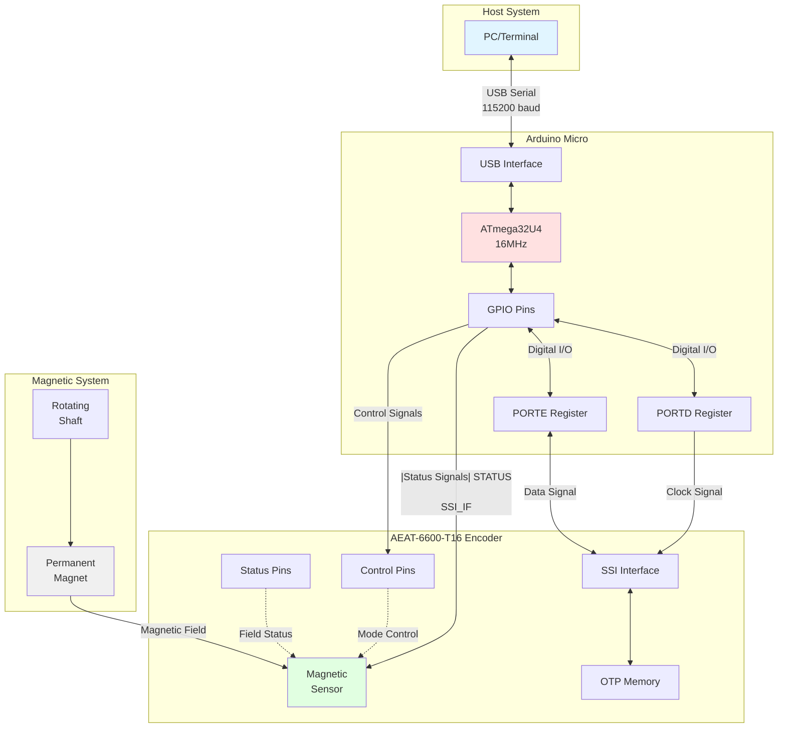
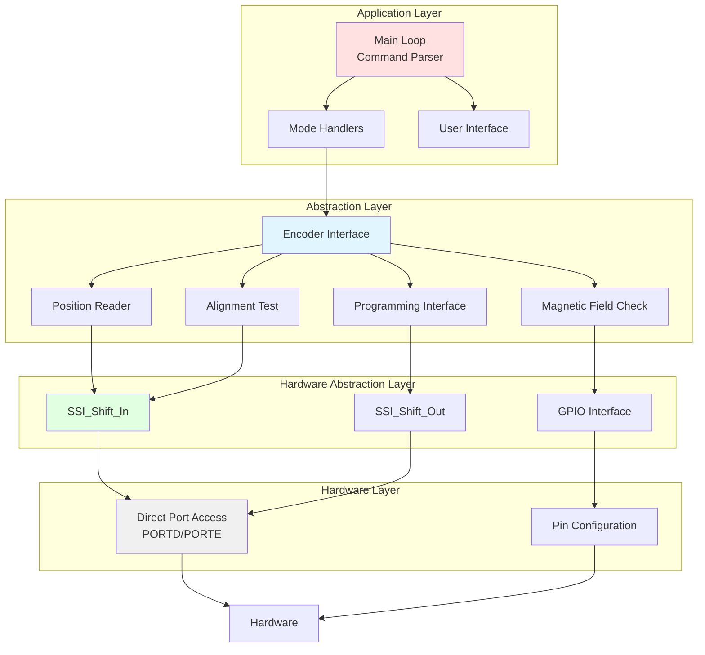
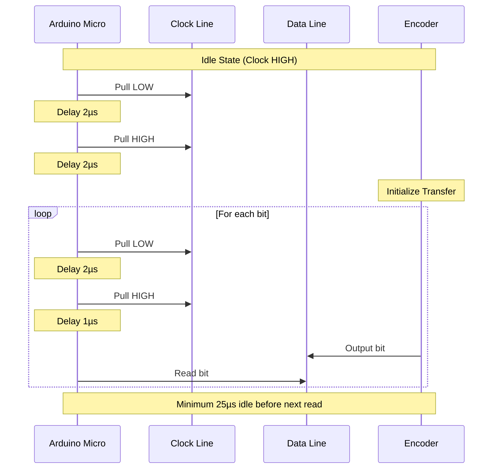
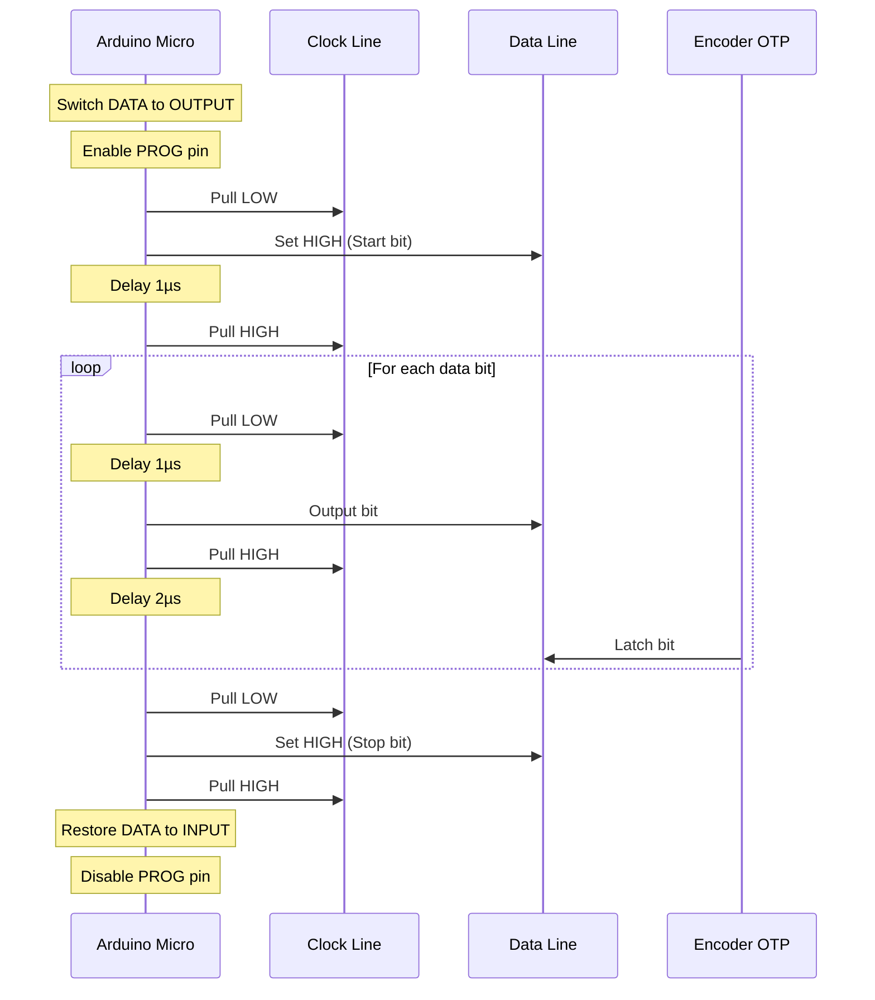
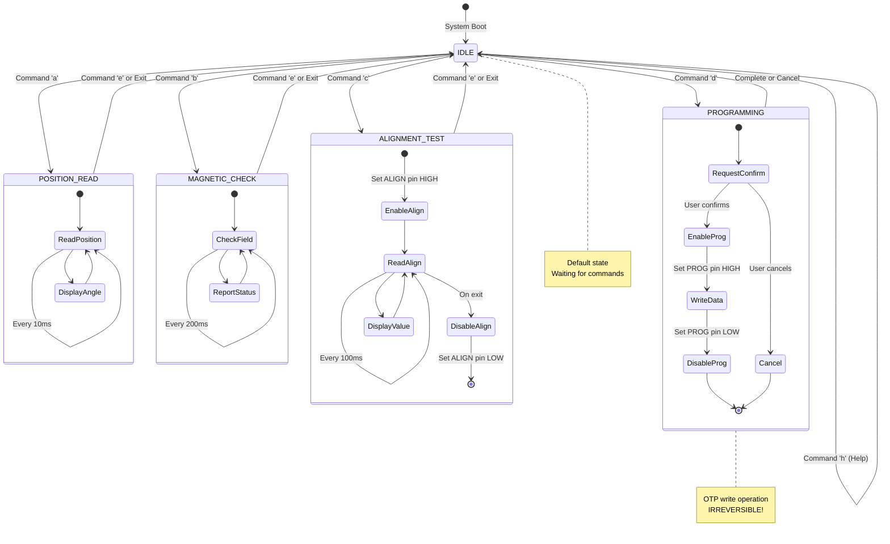
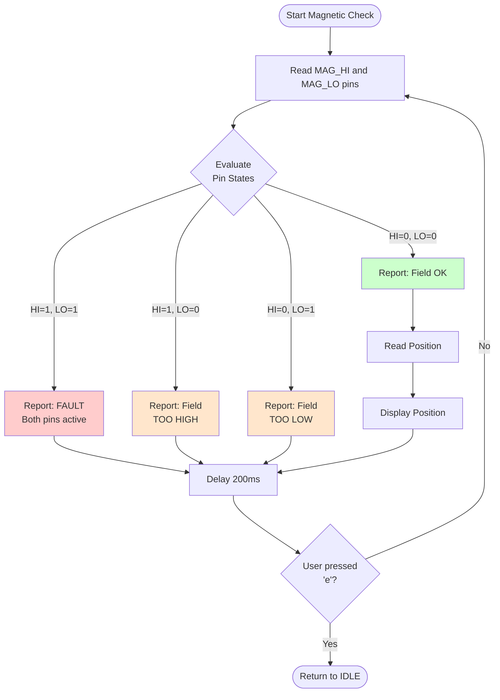
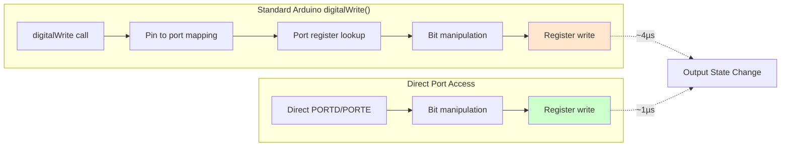
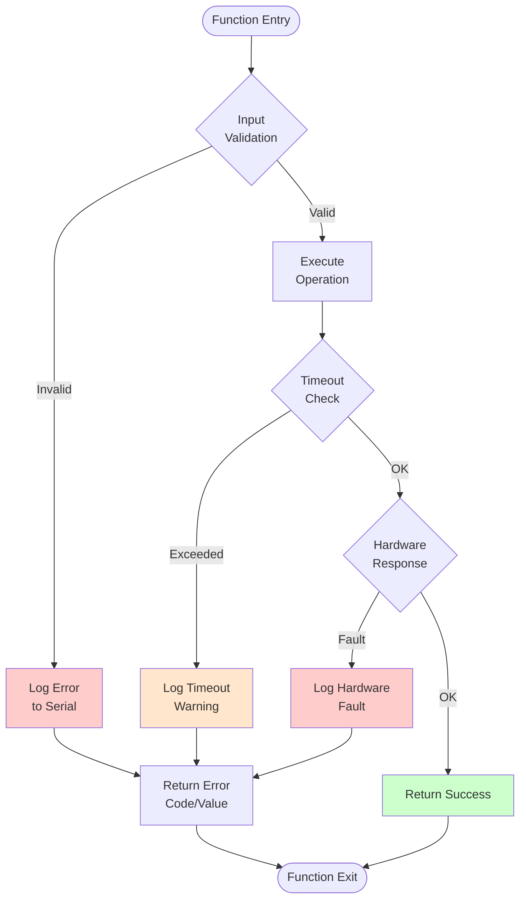

# System Architecture

## Table of Contents
- [Overview](#overview)
- [System Components](#system-components)
- [Software Architecture](#software-architecture)
- [Communication Protocol](#communication-protocol)
- [State Machine](#state-machine)
- [Data Flow](#data-flow)
- [Performance Considerations](#performance-considerations)

## Overview

The AEAT-6600-T16 Encoder Interface is a production-grade Arduino firmware designed to interface with the Broadcom AEAT-6600-T16 magnetic rotary encoder via the SSI (Synchronous Serial Interface) protocol.

### Key Features

- **High-Speed Communication**: ~400kHz SSI clock rate via direct port manipulation
- **Multiple Operational Modes**: Position reading, magnetic field monitoring, alignment testing, and programming
- **Robust Error Handling**: Input validation and fault detection
- **Production-Ready Code**: Comprehensive documentation, type safety, and maintainability

## System Components

### Hardware Components



### Component Responsibilities

| Component | Responsibility | Key Signals |
|-----------|----------------|-------------|
| **Arduino Micro** | Protocol converter, command interpreter | USB Serial, GPIO |
| **AEAT-6600-T16** | Magnetic position sensing, data conversion | SSI Clock/Data, Status pins |
| **SSI Interface** | High-speed synchronous serial communication | Clock, Data |
| **OTP Memory** | Persistent encoder configuration storage | Programmed via SSI |
| **Magnetic Sensor** | Convert magnetic field to digital position | Analog sensing → Digital output |

## Software Architecture

### Module Organization



### Namespace Structure

The firmware is organized into logical namespaces:

```cpp
namespace HardwareConfig {
  // Pin assignments and port bit positions
  // Maps logical pins to physical MCU pins
}

namespace EncoderConfig {
  // Encoder-specific parameters
  // Resolution, scaling factors, precision
}

namespace SerialConfig {
  // Serial communication parameters
  // Baud rate, timeouts
}

namespace TimingConfig {
  // SSI protocol timing constraints
  // Clock periods, setup times, intervals
}
```

## Communication Protocol

### SSI (Synchronous Serial Interface)

The SSI protocol is a synchronous serial communication standard optimized for encoder data transfer.

#### SSI Read Operation



#### SSI Write Operation (Programming)



### Protocol Timing

| Parameter | Value | Notes |
|-----------|-------|-------|
| **Clock Frequency** | ~400 kHz | Limited by Arduino execution speed |
| **Clock Low Time** | 2 µs | Per datasheet minimum |
| **Clock High Time** | 2 µs | Per datasheet minimum |
| **Setup Time** | 1 µs | Data valid before clock edge |
| **Minimum Idle Time** | 25 µs | Required between successive reads |

## State Machine

### Operational Modes



### State Transitions

| Current State | Event | Next State | Actions |
|---------------|-------|------------|---------|
| IDLE | User command 'a' | POSITION_READ | Start continuous position polling |
| IDLE | User command 'b' | MAGNETIC_CHECK | Start field monitoring |
| IDLE | User command 'c' | ALIGNMENT_TEST | Enable ALIGN mode, start polling |
| IDLE | User command 'd' | PROGRAMMING | Request confirmation |
| Any Mode | User command 'e' | IDLE | Disable control pins, flush buffers |
| PROGRAMMING | User confirms 'y' | Programming sequence | Enable PROG, write data |
| PROGRAMMING | User cancels | IDLE | No action taken |

## Data Flow

### Position Reading Data Flow

```mermaid
flowchart LR
    subgraph "Physical Domain"
        SHAFT[Rotating Shaft] -->|Mechanical<br/>Rotation| MAGNET[Magnet]
        MAGNET -->|Magnetic<br/>Field| HALL[Hall Effect<br/>Sensors]
    end

    subgraph "Encoder Domain"
        HALL -->|Analog<br/>Signals| ADC[ADC +<br/>Processing]
        ADC -->|10-bit<br/>Position| SSI_TX[SSI<br/>Transmitter]
    end

    subgraph "Firmware Domain"
        SSI_TX -->|Serial<br/>Data| SSI_RX[SSI_Shift_In<br/>Function]
        SSI_RX -->|Raw<br/>0-1023| SCALE[Position<br/>Scaling]
        SCALE -->|0.00-359.99°| FORMAT[Format<br/>Output]
    end

    subgraph "User Domain"
        FORMAT -->|ASCII<br/>Text| SERIAL[Serial<br/>Output]
        SERIAL -->|USB| USER[User<br/>Terminal]
    end

    style SHAFT fill:#f0f0f0
    style HALL fill:#e1ffe1
    style ADC fill:#e1ffe1
    style SSI_RX fill:#e1f5ff
    style SCALE fill:#e1f5ff
    style USER fill:#ffe1e1
```



### Magnetic Field Check Data Flow



## Performance Considerations

### Direct Port Manipulation

The firmware uses direct AVR port manipulation instead of Arduino's `digitalWrite()` for critical timing paths:



**Performance Comparison:**

| Method | Execution Time | SSI Clock Rate | Jitter |
|--------|---------------|----------------|--------|
| `digitalWrite()` | ~4 µs per call | ~100 kHz | High |
| Direct port access | ~1 µs per call | ~400 kHz | Low |

### Memory Optimization

**Flash Memory Usage (Optimizations):**
- Use of `F()` macro for string literals → Stores strings in flash instead of RAM
- `const` qualifiers → Compiler optimizations
- Namespaces → Zero runtime overhead, organizational benefits only

**RAM Usage:**
- Minimal global state (SystemState struct: ~6 bytes)
- Stack-based variables in functions
- No dynamic memory allocation

### Timing Constraints

```mermaid
gantt
    title SSI Read Operation Timing (10-bit transfer)
    dateFormat X
    axisFormat %L

    section Initialization
    Clock LOW  :done, init1, 0, 2
    Clock HIGH :done, init2, 2, 4

    section Bit 0
    Clock LOW  :done, b0_1, 4, 6
    Clock HIGH :done, b0_2, 6, 8
    Read Data  :active, b0_3, 7, 8

    section Bit 1
    Clock LOW  :done, b1_1, 8, 10
    Clock HIGH :done, b1_2, 10, 12
    Read Data  :active, b1_3, 11, 12

    section ...
    More bits  :crit, dots, 12, 28

    section Bit 9
    Clock LOW  :done, b9_1, 28, 30
    Clock HIGH :done, b9_2, 30, 32
    Read Data  :active, b9_3, 31, 32

    section Idle
    Min Idle   :milestone, idle, 32, 57
```



**Total transfer time for 10-bit read:**
- Initialization: 4 µs
- 10 bits × 3 µs = 30 µs
- Minimum idle: 25 µs
- **Total: ~59 µs minimum between reads**
- **Maximum sample rate: ~17 kHz**

### Error Handling Strategy



## System Reliability

### Fault Detection

| Fault Type | Detection Method | Response |
|------------|------------------|----------|
| **Serial Timeout** | `while(!Serial && millis() < 5000)` | Continue after 5s |
| **Magnetic Field Fault** | MAG_HI && MAG_LO both HIGH | Report error, continue monitoring |
| **Field Too High** | MAG_HI == HIGH only | Warning message |
| **Field Too Low** | MAG_LO == HIGH only | Warning message |
| **User Cancel** | Check for 'e' command | Exit mode cleanly |
| **Programming Abort** | Confirmation check | Cancel without write |

### Recovery Mechanisms

1. **Serial Buffer Flush**: `flushSerialInput()` prevents command overlap
2. **Mode Exit**: All control pins reset to LOW when exiting modes
3. **State Tracking**: Global `g_systemState` maintains consistent state
4. **Timeout Protection**: Serial initialization timeout prevents hang

---

**Document Version**: 1.0.0
**Last Updated**: 2025-11-04
**Author**: Claude Code
**License**: GPL-3.0
