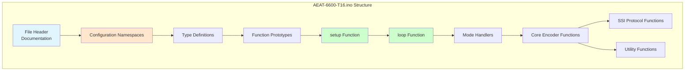
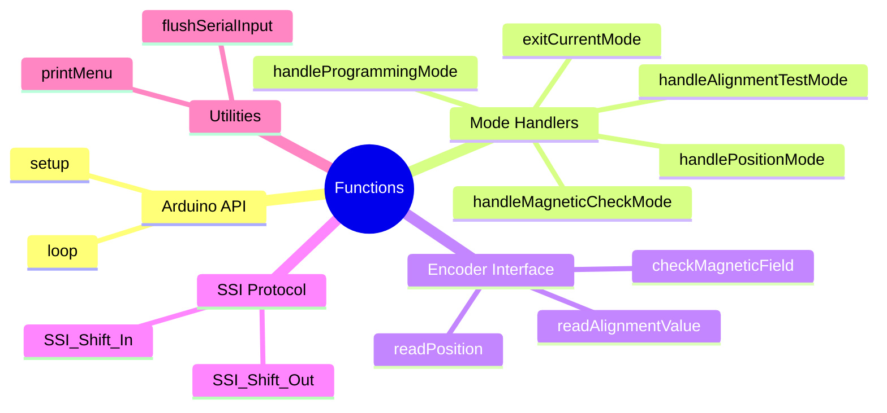
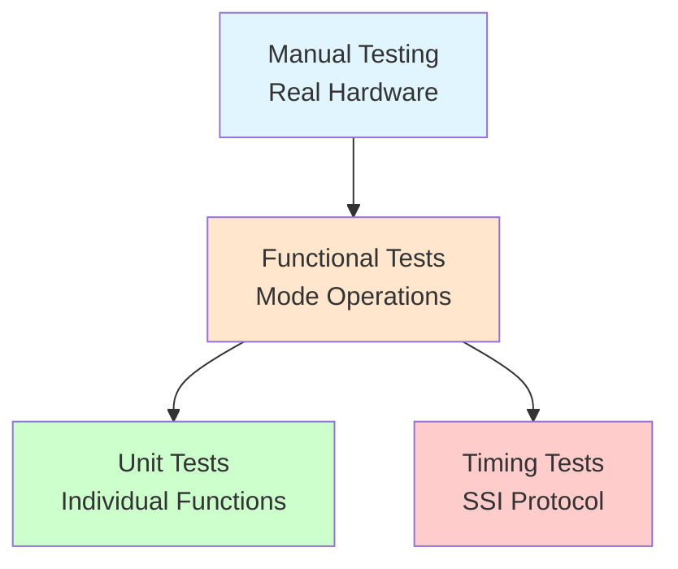
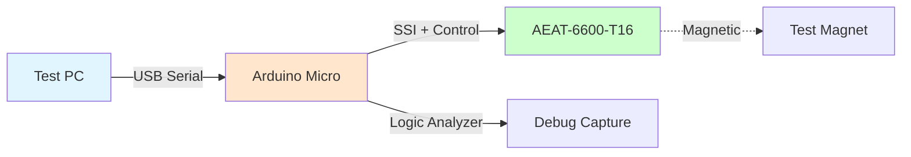
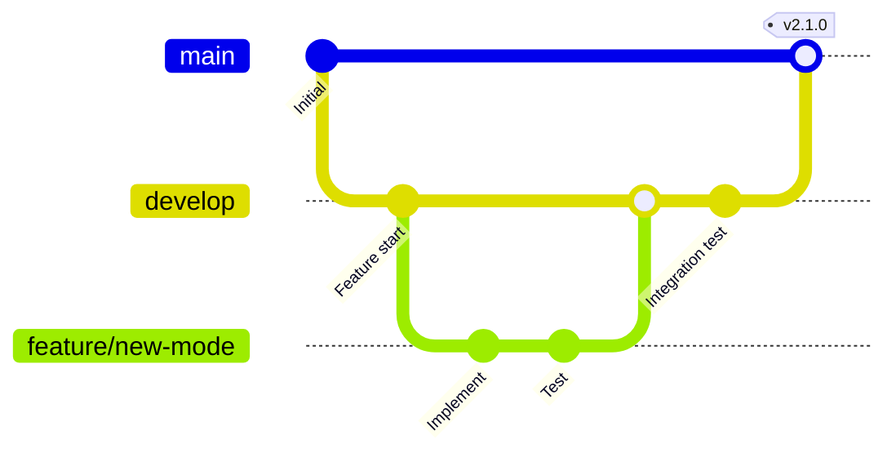

# Development Guide

## Table of Contents
- [Getting Started](#getting-started)
- [Development Environment Setup](#development-environment-setup)
- [Code Structure](#code-structure)
- [Building and Uploading](#building-and-uploading)
- [Debugging](#debugging)
- [Testing](#testing)
- [Contributing Guidelines](#contributing-guidelines)
- [Porting to Other Hardware](#porting-to-other-hardware)
- [Advanced Topics](#advanced-topics)

## Getting Started

### Prerequisites

**Required Software:**
- [Arduino IDE](https://www.arduino.cc/en/software) 1.8.x or 2.x
- OR [VS Code](https://code.visualstudio.com/) with [Arduino extension](https://marketplace.visualstudio.com/items?itemName=vsciot-vscode.vscode-arduino)
- USB drivers for Arduino Micro (usually automatic)

**Required Hardware:**
- Arduino Micro board (ATmega32U4)
- AEAT-6600-T16 encoder chip (with breakout board if needed)
- USB Micro-B cable
- Permanent magnet (diametrically magnetized)

**Knowledge Prerequisites:**
- Basic C/C++ programming
- Understanding of Arduino platform
- Familiarity with serial communication
- Basic understanding of digital I/O and timing

### Quick Start

```bash
# Clone the repository
git clone https://github.com/4nswer/AEAT-6600-T16.git
cd AEAT-6600-T16

# Open in Arduino IDE
# File -> Open -> AEAT-6600-T16.ino

# Select board
# Tools -> Board -> Arduino AVR Boards -> Arduino Micro

# Select port
# Tools -> Port -> (select your Arduino's COM port)

# Upload
# Sketch -> Upload (or Ctrl+U)
```

## Development Environment Setup

### Option 1: Arduino IDE (Recommended for Beginners)


**Steps:**

1. **Install Arduino IDE**
   - Download from [arduino.cc](https://www.arduino.cc/en/software)
   - Install using default settings
   - Launch IDE

2. **Configure Board**
   ```
   Tools -> Board -> Arduino AVR Boards -> Arduino Micro
   ```

3. **Select Port**
   - Connect Arduino via USB
   - Tools -> Port -> (select the port with "Arduino Micro" label)

4. **Verify Installation**
   - Open: File -> Examples -> 01.Basics -> Blink
   - Upload to verify toolchain works

### Option 2: VS Code (Recommended for Advanced Users)

**Advantages:**
- Superior code editing features
- Integrated Git support
- IntelliSense code completion
- Better code navigation

**Setup Steps:**

1. **Install VS Code**
   ```bash
   # Visit https://code.visualstudio.com/
   # Download and install for your platform
   ```

2. **Install Arduino Extension**
   - Open VS Code
   - Press Ctrl+Shift+X (Extensions)
   - Search "Arduino"
   - Install "Arduino" by Microsoft

3. **Configure Workspace**

   Create `.vscode/arduino.json`:
   ```json
   {
       "port": "COM5",              // Change to your port
       "board": "arduino:avr:micro",
       "sketch": "AEAT-6600-T16.ino"
   }
   ```

   Create `.vscode/c_cpp_properties.json`:
   ```json
   {
       "configurations": [
           {
               "name": "Arduino",
               "includePath": [
                   "${workspaceFolder}/**",
                   "C:/Program Files (x86)/Arduino/hardware/arduino/avr/cores/arduino/**",
                   "C:/Program Files (x86)/Arduino/hardware/arduino/avr/libraries/**"
               ],
               "defines": [
                   "ARDUINO=10819",
                   "ARDUINO_AVR_MICRO",
                   "ARDUINO_ARCH_AVR",
                   "F_CPU=16000000L"
               ],
               "compilerPath": "C:/Program Files (x86)/Arduino/hardware/tools/avr/bin/avr-gcc.exe",
               "cStandard": "c11",
               "cppStandard": "c++17",
               "intelliSenseMode": "gcc-x64"
           }
       ],
       "version": 4
   }
   ```

4. **Build and Upload**
   - Press Ctrl+Alt+R to verify/compile
   - Press Ctrl+Alt+U to upload

### Option 3: Command Line (PlatformIO)

**For automation and CI/CD:**

1. **Install PlatformIO Core**
   ```bash
   pip install platformio
   ```

2. **Create platformio.ini**
   ```ini
   [env:micro]
   platform = atmelavr
   board = micro
   framework = arduino
   monitor_speed = 115200
   ```

3. **Build and Upload**
   ```bash
   pio run              # Build
   pio run --target upload    # Upload
   pio device monitor   # Open serial monitor
   ```

## Code Structure

### File Organization

```
AEAT-6600-T16/
├── AEAT-6600-T16.ino          # Main firmware source
├── README.md                   # Project overview
├── ARCHITECTURE.md             # System architecture docs
├── HARDWARE_SETUP.md           # Hardware connection guide
├── API_REFERENCE.md            # Command API documentation
├── DEVELOPMENT.md              # This file
├── CHANGELOG.md                # Version history
├── LICENSE                     # GPL-3.0 license
├── Schematic_*.pdf            # Circuit schematic
└── .vscode/                   # VS Code configuration
    ├── arduino.json
    └── c_cpp_properties.json
```

### Source Code Layout



### Namespace Organization

| Namespace | Purpose | Key Constants |
|-----------|---------|---------------|
| `HardwareConfig` | Pin assignments and port mappings | Pin numbers, port bit positions |
| `EncoderConfig` | Encoder parameters | Resolution, scaling factors |
| `SerialConfig` | Serial communication settings | Baud rate, timeouts |
| `TimingConfig` | Timing constants for SSI protocol | Clock periods, delays |

### Function Categories



## Building and Uploading

### Compilation Process

```mermaid
sequenceDiagram
    participant IDE as Arduino IDE
    participant GCC as avr-gcc Compiler
    participant LINK as Linker
    participant HEX as Intel HEX
    participant UPLOAD as avrdude

    IDE->>GCC: Compile .ino to .cpp
    GCC->>GCC: Preprocess
    GCC->>GCC: Compile to .o
    GCC->>LINK: Link with Arduino core
    LINK->>HEX: Generate .hex file
    HEX->>UPLOAD: Upload via USB
    UPLOAD->>Arduino: Flash to MCU
```

### Build Commands

**Arduino IDE:**
```
Sketch -> Verify/Compile    (Ctrl+R)   # Compile only
Sketch -> Upload            (Ctrl+U)   # Compile and upload
```

**VS Code:**
```
Arduino: Verify             (Ctrl+Alt+R)
Arduino: Upload             (Ctrl+Alt+U)
```

**Command Line:**
```bash
# Using arduino-cli
arduino-cli compile --fqbn arduino:avr:micro AEAT-6600-T16.ino
arduino-cli upload -p COM5 --fqbn arduino:avr:micro AEAT-6600-T16.ino

# Using PlatformIO
pio run
pio run --target upload
```

### Memory Usage

**Typical memory footprint:**

| Resource | Usage | Maximum | Percentage |
|----------|-------|---------|------------|
| **Flash (Program)** | ~8 KB | 28 KB | ~29% |
| **RAM (Dynamic)** | ~500 bytes | 2.5 KB | ~20% |
| **EEPROM** | 0 bytes | 1 KB | 0% |

**To check memory usage:**
```
Arduino IDE: After compilation, check console output
"Sketch uses X bytes (Y%) of program storage space..."
```

### Optimization Settings

**Compiler flags** (in `platform.txt` or board configuration):
- `-Os`: Optimize for size (default)
- `-O2`: Optimize for speed
- `-O3`: Maximum optimization (may increase code size)

**Memory optimization tips:**
- Use `F()` macro for string literals → saves RAM
- Use `const` and `PROGMEM` → stores in flash
- Avoid dynamic memory allocation → prevents fragmentation
- Use fixed-size buffers → predictable memory usage

## Debugging

### Serial Debugging

**Basic Debug Output:**

```cpp
// Add debug messages
Serial.print(F("DEBUG: Variable value = "));
Serial.println(myVariable);

// Conditional compilation for debug builds
#define DEBUG 1

#if DEBUG
  #define DEBUG_PRINT(x) Serial.print(F("DEBUG: ")); Serial.println(x)
#else
  #define DEBUG_PRINT(x)
#endif

// Usage
DEBUG_PRINT("Entering position read mode");
```

### Logic Analyzer / Oscilloscope

**Key signals to monitor:**

```mermaid
gantt
    title Debug Signal Capture Points
    dateFormat X
    axisFormat %L

    section Clock (D6)
    Idle HIGH  :done, clk1, 0, 10
    Read cycle :active, clk2, 10, 50
    Idle HIGH  :done, clk3, 50, 60

    section Data (D7)
    High-Z     :crit, dat1, 0, 10
    Data bits  :active, dat2, 10, 50
    High-Z     :crit, dat3, 50, 60

    section Trigger
    Position read :milestone, trig, 10, 10
```



**Oscilloscope Checklist:**
- [ ] Clock signal present and ~400kHz
- [ ] Clock duty cycle approximately 50%
- [ ] Data transitions synchronized with clock
- [ ] Voltage levels: 0V (LOW), 5V (HIGH)
- [ ] No ringing or excessive overshoot

### Common Issues and Solutions

| Issue | Symptom | Debug Method | Solution |
|-------|---------|--------------|----------|
| **No serial output** | Terminal blank | Check port, baud rate | Set 115200 baud, correct port |
| **Random characters** | Garbage text | Baud rate mismatch | Verify 115200 on both ends |
| **Position stuck at 0** | No data from encoder | Check SSI signals | Verify CLK/DATA wiring |
| **Erratic readings** | Noisy position values | Oscilloscope analysis | Add bypass caps, check grounds |
| **Compilation errors** | Build fails | Read error messages | Check syntax, includes, board selection |

### Debug Build Configuration

**Enable verbose output:**

```cpp
// At top of file
#define DEBUG_LEVEL 2  // 0=none, 1=errors, 2=info, 3=verbose

#if DEBUG_LEVEL >= 1
  #define DEBUG_ERROR(x) Serial.print(F("ERROR: ")); Serial.println(x)
#else
  #define DEBUG_ERROR(x)
#endif

#if DEBUG_LEVEL >= 2
  #define DEBUG_INFO(x) Serial.print(F("INFO: ")); Serial.println(x)
#else
  #define DEBUG_INFO(x)
#endif

// Usage
DEBUG_INFO("Starting SSI read");
DEBUG_ERROR("Invalid bit count");
```

## Testing

### Unit Testing Strategy

**Test Hierarchy:**



### Hardware-in-the-Loop Testing

**Test Setup:**



**Automated Test Script (Python):**

```python
import serial
import time
import unittest

class EncoderTests(unittest.TestCase):
    @classmethod
    def setUpClass(cls):
        cls.ser = serial.Serial('COM5', 115200, timeout=2)
        time.sleep(2)  # Wait for Arduino reset
        cls.ser.read_all()  # Clear startup messages

    @classmethod
    def tearDownClass(cls):
        cls.ser.close()

    def test_position_mode_entry(self):
        """Test entering position read mode"""
        self.ser.write(b'a')
        time.sleep(0.1)
        response = self.ser.read_all().decode('utf-8')
        self.assertIn('Position Read Mode', response)

    def test_position_format(self):
        """Test position output format"""
        self.ser.write(b'a')
        time.sleep(0.2)
        lines = self.ser.read_all().decode('utf-8').split('\n')
        for line in lines:
            if 'Position:' in line:
                # Expect format: "Position: XXX.XX°"
                parts = line.split(':')
                self.assertEqual(len(parts), 2)
                value = parts[1].strip().rstrip('°')
                angle = float(value)
                self.assertGreaterEqual(angle, 0.0)
                self.assertLess(angle, 360.0)
        self.ser.write(b'e')

    def test_magnetic_check(self):
        """Test magnetic field check mode"""
        self.ser.write(b'b')
        time.sleep(0.3)
        response = self.ser.read_all().decode('utf-8')
        # Should contain OK, WARNING, or ERROR
        self.assertTrue(
            'OK:' in response or
            'WARNING:' in response or
            'ERROR:' in response
        )
        self.ser.write(b'e')

if __name__ == '__main__':
    unittest.main()
```

### Performance Testing

**Measure SSI timing:**

```cpp
// In firmware
unsigned long startTime = micros();
readPosition();
unsigned long endTime = micros();
Serial.print(F("Read time: "));
Serial.print(endTime - startTime);
Serial.println(F(" us"));
```

**Expected results:**
- Position read: 35-60 µs
- Maximum sample rate: ~17 kHz

### Test Checklist

**Before Release:**
- [ ] All modes tested (a, b, c, d)
- [ ] Exit command works from all modes
- [ ] Position reading smooth and continuous
- [ ] Magnetic field check accurate
- [ ] Alignment test functional
- [ ] Programming mode confirmation works
- [ ] Help menu displays correctly
- [ ] No memory leaks (long-term test)
- [ ] Serial communication stable
- [ ] Timing constraints met

## Contributing Guidelines

### Code Style

**Naming Conventions:**

```cpp
// Namespaces: PascalCase
namespace HardwareConfig { }

// Constants: UPPER_CASE or camelCase (depending on scope)
const uint8_t PIN_NUMBER = 6;
const int maxValue = 100;

// Functions: camelCase
void readPosition() { }
void handlePositionMode() { }

// Variables: camelCase
float currentAngle = 0.0;
bool isInitialized = false;

// Enums: PascalCase for type, UPPER_CASE for values
enum class OperationMode : uint8_t {
    IDLE,
    POSITION_READ
};
```

**Documentation Standards:**

```cpp
/**
 * @brief Short description (one line)
 *
 * Detailed description of the function, explaining what it does,
 * why it exists, and any important implementation details.
 *
 * @param paramName Description of parameter
 * @return Description of return value
 *
 * @note Important notes or caveats
 * @warning Critical warnings about usage
 */
void myFunction(int paramName) {
    // Implementation
}
```

### Git Workflow



**Branch Naming:**
- `main`: Production-ready code
- `develop`: Integration branch
- `feature/description`: New features
- `bugfix/description`: Bug fixes
- `hotfix/description`: Critical fixes

**Commit Message Format:**

```
<type>: <subject>

<body>

<footer>
```

**Example:**
```
feat: Add power-down mode support

Implement low-power mode using PWR_DN pin. System enters
sleep when idle for > 60 seconds. Wakes on serial activity.

- Add timeout detection
- Control PWR_DN pin
- Document power consumption

Closes #15
```

### Pull Request Process

1. **Fork and Branch**
   ```bash
   git checkout -b feature/my-feature
   ```

2. **Develop and Test**
   - Write code following style guide
   - Add tests if applicable
   - Test on real hardware

3. **Commit Changes**
   ```bash
   git add .
   git commit -m "feat: Description"
   ```

4. **Push and PR**
   ```bash
   git push origin feature/my-feature
   # Create PR on GitHub
   ```

5. **Code Review**
   - Address reviewer comments
   - Update documentation
   - Ensure CI passes

6. **Merge**
   - Squash commits if needed
   - Merge to develop branch

## Porting to Other Hardware

### Porting to Different Arduino Boards

**Compatibility Matrix:**

| Board | Compatible? | Required Changes |
|-------|-------------|------------------|
| **Arduino Micro** | ✅ Native | None |
| **Arduino Leonardo** | ✅ Compatible | Update port mappings |
| **Arduino Uno** | ⚠️ Partial | Update ports (PORTD different) |
| **Arduino Mega** | ⚠️ Partial | Update all port mappings |
| **ESP32** | ❌ Needs rewrite | No direct port access |
| **Raspberry Pi Pico** | ❌ Needs rewrite | Different architecture |

**Port Mapping Changes:**

```cpp
// Arduino Micro (ATmega32U4) - CURRENT
// D6 = PORTD bit 7 (Clock)
// D7 = PORTE bit 6 (Data)

// Arduino Uno (ATmega328P) - REQUIRES UPDATE
// D6 = PORTD bit 6 (Clock)
// D7 = PORTD bit 7 (Data)

// Update in SSI functions:
// OLD: PORTD &= ~(1 << 7);  // Clock
//      bitRead(PINE, 6)     // Data

// NEW for Uno:
// PORTD &= ~(1 << 6);       // Clock on D6 = PORTD bit 6
// bitRead(PIND, 7)          // Data on D7 = PORTD bit 7
```

### Porting to Other Encoder Models

**For similar Broadcom encoders (e.g., AEAT-6012):**

1. **Update resolution:**
   ```cpp
   namespace EncoderConfig {
       const uint8_t BIT_COUNT = 12;      // Change from 10 to 12
       const uint16_t MAX_POSITION = 4096; // Change from 1024
   }
   ```

2. **Verify pin compatibility** - Check datasheet for pin differences

3. **Update alignment interpretation** - Different encoders may have different alignment value ranges

**For non-SSI encoders (e.g., SPI, I2C):**
- Replace `SSI_Shift_In()` and `SSI_Shift_Out()` with appropriate protocol functions
- May be able to use Arduino SPI or Wire libraries
- Update timing constants

## Advanced Topics

### Interrupt-Driven Operation

**Example: Using timer interrupt for position sampling:**

```cpp
#include <TimerOne.h>

volatile float lastPosition = 0.0;

void timerISR() {
    lastPosition = readPosition();
}

void setup() {
    // ... existing setup ...

    Timer1.initialize(10000);  // 10ms period
    Timer1.attachInterrupt(timerISR);
}

void loop() {
    // Position automatically updated in background
    Serial.println(lastPosition, 2);
    delay(100);
}
```

### DMA for High-Speed Sampling

**Theoretical implementation** (requires advanced AVR programming):
- Configure DMA channel for GPIO sampling
- Use hardware timer to trigger DMA transfers
- Store samples in circular buffer
- Process buffer in main loop

**Benefits:**
- Reduce CPU overhead
- More precise timing
- Higher sample rates

**Challenges:**
- Limited DMA on ATmega32U4
- Complex setup
- May require assembly code

### Firmware Over-The-Air (OTA) Updates

**Using bootloader approach:**

1. Implement custom bootloader that accepts firmware via serial
2. Add command to enter bootloader mode
3. Upload new firmware through serial protocol

**Example entry point:**
```cpp
case 'u':  // Update firmware
    Serial.println(F("Entering bootloader..."));
    ((void (*)(void))0x7000)();  // Jump to bootloader address
    break;
```

### Real-Time Operating System Integration

**Using FreeRTOS on Arduino:**

```cpp
#include <Arduino_FreeRTOS.h>

void TaskPositionRead(void *pvParameters) {
    for (;;) {
        float pos = readPosition();
        // Process position
        vTaskDelay(10 / portTICK_PERIOD_MS);
    }
}

void TaskSerialComm(void *pvParameters) {
    for (;;) {
        // Handle serial commands
        vTaskDelay(50 / portTICK_PERIOD_MS);
    }
}

void setup() {
    // ... existing setup ...

    xTaskCreate(TaskPositionRead, "Position", 128, NULL, 2, NULL);
    xTaskCreate(TaskSerialComm, "Serial", 128, NULL, 1, NULL);

    vTaskStartScheduler();
}

void loop() {
    // Not used with RTOS
}
```

---

## Additional Resources

### Datasheets and References

- **AEAT-6600-T16 Datasheet**: [AV02-2792EN](https://docs.broadcom.com/doc/AV02-2792EN)
- **Application Note**: [AV02-2791EN](https://docs.broadcom.com/wcs-public/products/application-notes/application-note/696/604/av02-2791en_an_5501_aeat-6600_2014-04-21.pdf)
- **ATmega32U4 Datasheet**: [Microchip/Atmel](https://www.microchip.com/wwwproducts/en/ATmega32U4)
- **Arduino Language Reference**: [arduino.cc/reference](https://www.arduino.cc/reference/en/)

### Tools and Utilities

- **Arduino IDE**: https://www.arduino.cc/en/software
- **PlatformIO**: https://platformio.org/
- **Saleae Logic Analyzer**: https://www.saleae.com/
- **PulseView (Open Source Logic Analyzer)**: https://sigrok.org/wiki/PulseView

### Community and Support

- **GitHub Repository**: https://github.com/4nswer/AEAT-6600-T16
- **Arduino Forum**: https://forum.arduino.cc/
- **Issues and Bugs**: Report at GitHub Issues page

---

**Document Version**: 1.0.0
**Last Updated**: 2025-11-04
**Author**: Claude Code
**License**: GPL-3.0
