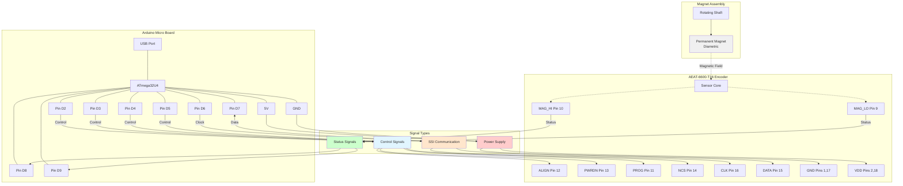
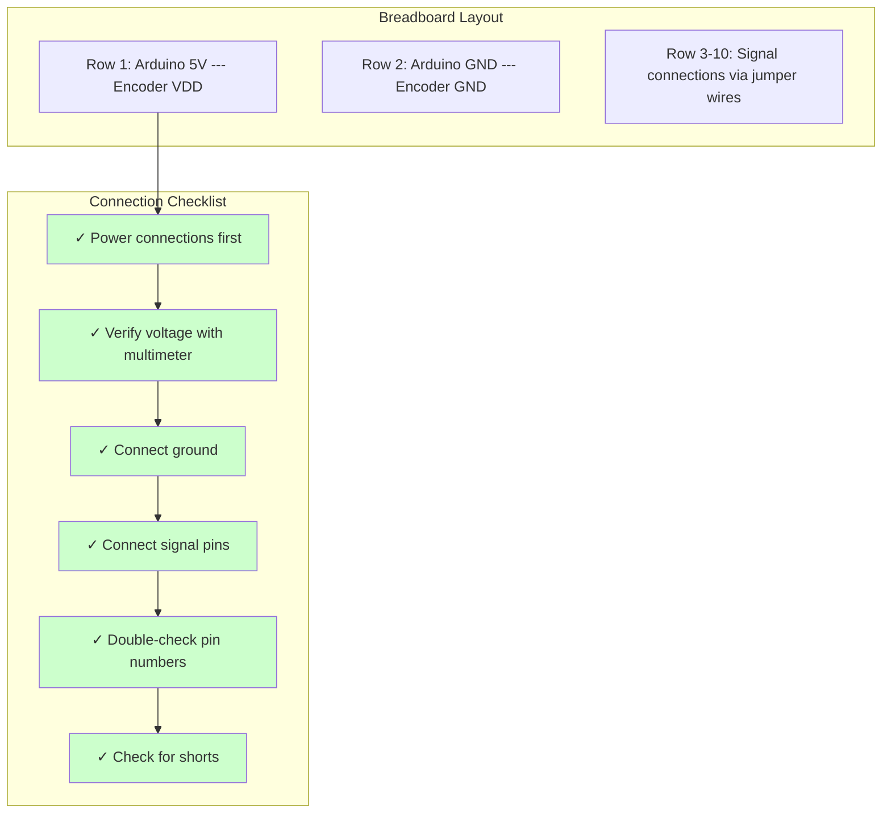
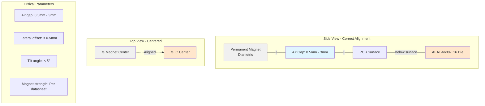
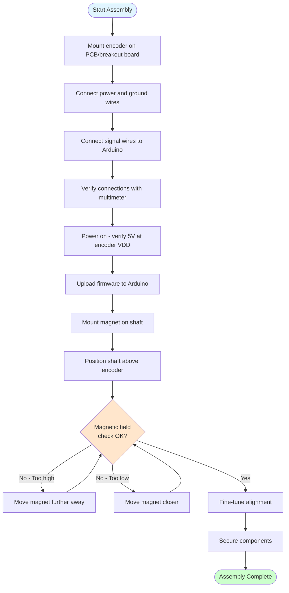
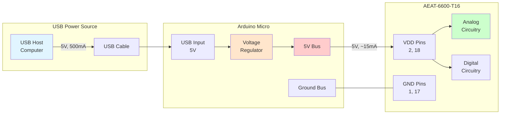
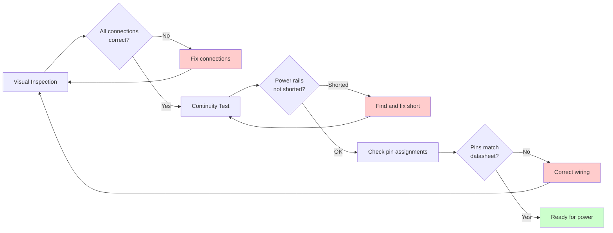
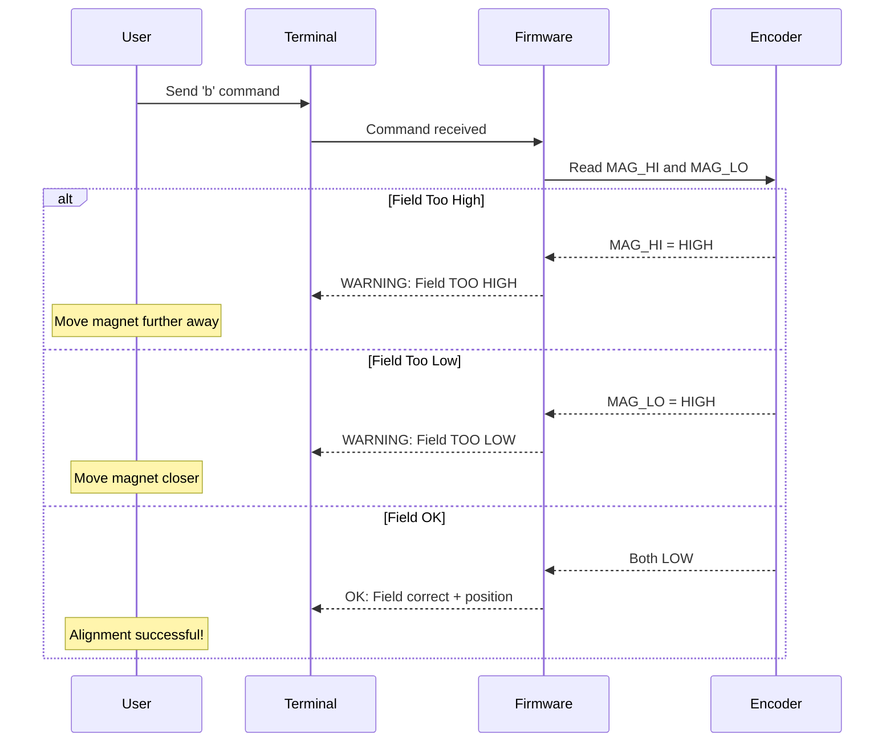

# Hardware Setup Guide

## Table of Contents
- [Required Components](#required-components)
- [Pin Connections](#pin-connections)
- [Wiring Diagram](#wiring-diagram)
- [Mechanical Assembly](#mechanical-assembly)
- [Power Requirements](#power-requirements)
- [Testing and Verification](#testing-and-verification)
- [Troubleshooting](#troubleshooting)
- [Safety Considerations](#safety-considerations)

## Required Components

### Essential Components

| Component | Specification | Quantity | Notes |
|-----------|--------------|----------|-------|
| **Arduino Micro** | ATmega32U4 @ 16MHz, 5V | 1 | Other Arduino boards require code modification |
| **AEAT-6600-T16** | Broadcom magnetic encoder | 1 | 10-bit absolute encoder |
| **Permanent Magnet** | Diametrically magnetized | 1 | Size per encoder datasheet (typically Ø6mm) |
| **USB Cable** | Micro-B USB | 1 | For programming and serial communication |
| **Jumper Wires** | Male-to-male | 10+ | 22-24 AWG recommended |
| **Breadboard** | Half or full size | 1 | Optional but recommended for prototyping |

### Recommended Additional Components

| Component | Purpose |
|-----------|---------|
| **Breakout board** | For AEAT-6600-T16 QFN package |
| **Oscilloscope** | Signal verification and debugging |
| **Multimeter** | Power and continuity testing |
| **Mounting bracket** | Secure encoder positioning |
| **Shaft coupling** | Connect encoder to rotating shaft |

## Pin Connections

### Complete Pin Mapping

```mermaid
graph LR
    subgraph "Arduino Micro Pins"
        D2[D2 Digital Pin]
        D3[D3 Digital Pin]
        D4[D4 Digital Pin]
        D5[D5 Digital Pin]
        D6[D6 Digital Pin]
        D7[D7 Digital Pin]
        D8[D8 Digital Pin]
        D9[D9 Digital Pin]
        GND1[GND]
        VCC1[5V]
    end

    subgraph "AEAT-6600-T16 Pins"
        ALIGN_PIN[ALIGN Pin 12]
        PWRDN_PIN[PWRDN Pin 13]
        PROG_PIN[PROG Pin 11]
        NCS_PIN[NCS Pin 14]
        CLK_PIN[CLK Pin 16]
        DATA_PIN[DATA Pin 15]
        MAGHI_PIN[MAG_HI Pin 10]
        MAGLO_PIN[MAG_LO Pin 9]
        GND2[GND Pins 1,17]
        VCC2[VDD Pins 2,18]
    end

    D2 -->|Control| ALIGN_PIN
    D3 -->|Control| PWRDN_PIN
    D4 -->|Control| PROG_PIN
    D5 -->|Control| NCS_PIN
    D6 -->|SSI Clock| CLK_PIN
    D7 -->|SSI Data| DATA_PIN
    D8 <--|Status| MAGHI_PIN
    D9 <--|Status| MAGLO_PIN
    GND1 ---|Ground| GND2
    VCC1 ---|Power +5V| VCC2

    style D6 fill:#ffe6cc
    style D7 fill:#ffe6cc
    style CLK_PIN fill:#ffe6cc
    style DATA_PIN fill:#ffe6cc
```

### Detailed Pin Table

| Arduino Pin | Direction | AEAT-6600 Pin | Pin Number | Function | Notes |
|-------------|-----------|---------------|------------|----------|-------|
| **D8** | INPUT | MAG_HI / OTP_ERR | 10 | Magnetic field too high indicator | Also indicates OTP programming errors |
| **D9** | INPUT | MAG_LO / OTP_PROG_STAT | 9 | Magnetic field too low indicator | Also shows OTP programming status |
| **D2** | OUTPUT | ALIGN | 12 | Alignment mode enable | HIGH = alignment mode active |
| **D3** | OUTPUT | PWRDN | 13 | Power down control | HIGH = power down (unused in this firmware) |
| **D4** | OUTPUT | PROG | 11 | Programming mode enable | HIGH = OTP programming enabled |
| **D5** | OUTPUT | NCS | 14 | Chip select (active low) | Not used in current implementation |
| **D6** | OUTPUT | CLK | 16 | SSI clock signal | **PORTD bit 7** - Critical timing |
| **D7** | INPUT/OUTPUT | DATA | 15 | SSI data signal | **PORTE bit 6** - Bidirectional |
| **GND** | - | GND / EGND | 1, 17 | Ground reference | Connect all GND pins together |
| **5V** | - | VDD | 2, 18 | Power supply (+5V) | 4.5V - 5.5V acceptable range |

### Port Mapping (Important for Code Modifications)

If you need to port this code to a different microcontroller or change pin assignments:

| Arduino Pin | AVR Port | Bit Position | Access Method |
|-------------|----------|--------------|---------------|
| **D6** (Clock) | PORTD | Bit 7 | `PORTD \|= (1 << 7)` (HIGH)<br/>`PORTD &= ~(1 << 7)` (LOW) |
| **D7** (Data) | PORTE | Bit 6 | Write: `bitWrite(PORTE, 6, value)`<br/>Read: `bitRead(PINE, 6)` |

## Wiring Diagram

### Physical Connection Layout



### Breadboard Connection Example



## Mechanical Assembly

### Magnet Positioning

The magnet must be positioned correctly relative to the encoder chip for accurate readings.



### Assembly Steps



## Power Requirements

### Power Specifications

| Parameter | Minimum | Typical | Maximum | Unit | Notes |
|-----------|---------|---------|---------|------|-------|
| **Supply Voltage (VDD)** | 4.5 | 5.0 | 5.5 | V | Stable power supply required |
| **Supply Current (Active)** | - | 15 | 25 | mA | During normal operation |
| **Supply Current (Idle)** | - | 5 | 10 | mA | Low power mode |
| **Arduino Consumption** | - | 40 | 50 | mA | USB powered |
| **Total System** | - | 55 | 75 | mA | Encoder + Arduino |

### Power Distribution



### Power Quality Considerations

**Important Notes:**
1. **Decoupling Capacitors**: Place 100nF ceramic capacitor close to encoder VDD pins
2. **Stable Supply**: Voltage ripple should be < 50mV peak-to-peak
3. **Ground Plane**: Use solid ground connection for noise reduction
4. **Wire Length**: Keep power wires short (< 15cm) to minimize voltage drop

## Testing and Verification

### Step-by-Step Verification Procedure

#### 1. Pre-Power Checks



#### 2. Power-On Verification

| Test | Expected Result | Action if Failed |
|------|----------------|------------------|
| **Measure Arduino 5V pin** | 4.8V - 5.2V | Check USB connection |
| **Measure encoder VDD** | 4.8V - 5.2V | Check power wiring |
| **Measure current draw** | < 100mA total | Check for shorts |
| **Arduino LED** | Blinking/On | Re-upload bootloader |

#### 3. Communication Test

```bash
# Open serial monitor at 115200 baud
# Expected output after connection:
========================================
AEAT-6600-T16 Encoder Interface v2.0.0
========================================

Available Commands:
  a - Position Read Mode
  b - Magnetic Field Check
  c - Alignment Test Mode
  d - Programming Mode
  e - Exit current mode
  h - Show this menu
```

#### 4. Magnetic Field Verification



### Test Checklist

- [ ] Power supply voltage verified (4.8V - 5.2V)
- [ ] Current consumption normal (< 100mA)
- [ ] Serial communication established (115200 baud)
- [ ] Menu displayed correctly
- [ ] Magnetic field check mode functional (command 'b')
- [ ] Magnet positioned correctly (OK message displayed)
- [ ] Position reading mode functional (command 'a')
- [ ] Position changes when shaft rotates
- [ ] Values range from 0.00° to 359.99°
- [ ] Alignment test mode accessible (command 'c')
- [ ] Exit command works (command 'e')

## Troubleshooting

### Common Issues and Solutions

| Symptom | Possible Cause | Solution |
|---------|---------------|----------|
| **No serial output** | Wrong baud rate | Set terminal to 115200 baud |
| | USB connection issue | Try different USB port/cable |
| | Firmware not uploaded | Re-upload firmware |
| **"Field TOO HIGH"** | Magnet too close | Increase air gap to 1-2mm |
| | Wrong magnet type | Use diametrically magnetized magnet |
| **"Field TOO LOW"** | Magnet too far | Decrease air gap to 0.5-1mm |
| | Weak magnet | Replace with stronger magnet per datasheet |
| | Magnet misaligned | Center magnet over IC |
| **"FAULT" message** | Wiring error | Check MAG_HI and MAG_LO connections |
| | Encoder damaged | Test encoder on known-good hardware |
| **Position not changing** | SSI communication failure | Check CLK and DATA connections |
| | Clock/data swapped | Verify D6=CLK, D7=DATA |
| | Magnet not rotating | Ensure mechanical coupling working |
| **Erratic readings** | Poor connections | Check all jumper wires, reseat connections |
| | Electrical noise | Add bypass capacitors, shorten wires |
| | Magnetic interference | Remove nearby magnets/motors |
| **Position jumps** | Magnet eccentric to shaft | Re-center and secure magnet |
| | Air gap varying | Ensure shaft doesn't wobble |

### Debug Signal Analysis

If you have an oscilloscope, verify these signals:

```mermaid
gantt
    title Expected SSI Clock Signal (D6)
    dateFormat X
    axisFormat %L

    section Idle
    High State :done, idle, 0, 10

    section Read Cycle
    Init Low   :done, init1, 10, 12
    Init High  :done, init2, 12, 14
    Bit0 Low   :done, b0l, 14, 16
    Bit0 High  :done, b0h, 16, 18
    Bit1 Low   :done, b1l, 18, 20
    Bit1 High  :done, b1h, 20, 22
    More Bits  :active, more, 22, 44

    section Idle
    High State :done, idle2, 44, 70
```



**Expected signal characteristics:**
- **Idle state**: Clock HIGH (5V)
- **Clock frequency**: ~400 kHz (2.5 µs period)
- **Clock duty cycle**: ~50%
- **Voltage levels**: 0V (LOW), 5V (HIGH)

### Advanced Diagnostics

#### Testing SSI Communication Independently

If encoder communication fails, test the SSI signals:

1. **Clock Signal Test**: Use oscilloscope or logic analyzer on D6
   - Should see square wave when reading position
   - Frequency ~400kHz during active communication

2. **Data Signal Test**: Monitor D7 with oscilloscope
   - Should see data pulses synchronized with clock
   - Data changes on clock edges

3. **Loopback Test**: Connect D7 directly to D6
   - Modify firmware to read back clock signal as data
   - Verifies Arduino GPIO functionality

## Safety Considerations

### Electrical Safety

⚠️ **WARNING**: Although this is a low-voltage system (5V), observe these precautions:

- Do not connect/disconnect wires while powered
- Verify polarity before applying power
- Use appropriate ESD protection when handling encoder IC
- Do not exceed 5.5V on any pin
- Ensure proper ventilation if running for extended periods

### Mechanical Safety

- Secure all rotating components before testing
- Ensure magnet is firmly attached to shaft (could become projectile)
- Keep fingers away from rotating parts
- Use shaft guards if operating at high speeds

### Programming Safety

⚠️ **CRITICAL**: The Programming Mode (command 'd') writes to **One-Time Programmable (OTP) memory**

- **OTP writes are PERMANENT and IRREVERSIBLE**
- **Do not use programming mode unless you fully understand the implications**
- Verify programming data thoroughly before confirming
- Keep backup encoder for critical applications
- Test configuration on spare encoder first

---

## Additional Resources

### Pinout Reference Card

Print this for quick reference during assembly:

```
╔════════════════════════════════════════════════════╗
║  AEAT-6600-T16 Quick Pin Reference                 ║
╠════════════════════════════════════════════════════╣
║  Arduino  →  Encoder    Function                   ║
╠════════════════════════════════════════════════════╣
║  D2       →  Pin 12     ALIGN (control)            ║
║  D3       →  Pin 13     PWRDN (control)            ║
║  D4       →  Pin 11     PROG (control)             ║
║  D5       →  Pin 14     NCS (control)              ║
║  D6       →  Pin 16     CLK (SSI clock) ⚡         ║
║  D7       →  Pin 15     DATA (SSI data) ⚡         ║
║  D8       ←  Pin 10     MAG_HI (status)            ║
║  D9       ←  Pin 9      MAG_LO (status)            ║
║  5V       →  Pin 2,18   VDD (power)                ║
║  GND      →  Pin 1,17   GND (ground)               ║
╚════════════════════════════════════════════════════╝
         ⚡ = Critical timing signals
```

### External Documentation

- **Encoder Datasheet**: [AV02-2792EN](https://docs.broadcom.com/doc/AV02-2792EN)
- **Application Notes**: [AV02-2791EN](https://docs.broadcom.com/wcs-public/products/application-notes/application-note/696/604/av02-2791en_an_5501_aeat-6600_2014-04-21.pdf)
- **Arduino Micro Pinout**: [Arduino Official](https://www.arduino.cc/en/Main/Arduino_BoardMicro)

---

**Document Version**: 1.0.0
**Last Updated**: 2025-11-04
**Author**: Claude Code
**License**: GPL-3.0
