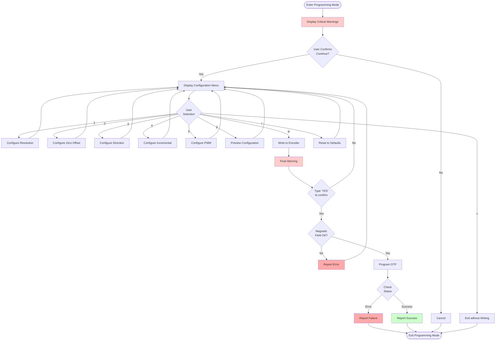

# OTP Programming Guide

## Table of Contents
- [Overview](#overview)
- [Critical Warnings](#critical-warnings)
- [Programmable Features](#programmable-features)
- [Programming Procedure](#programming-procedure)
- [OTP Register Structure](#otp-register-structure)
- [Parameter Descriptions](#parameter-descriptions)
- [Configuration Examples](#configuration-examples)
- [Troubleshooting](#troubleshooting)
- [Best Practices](#best-practices)

## Overview

The AEAT-6600-T16 encoder includes **One-Time Programmable (OTP) memory** that allows you to configure various encoder parameters permanently. This guide explains how to use the comprehensive programming menu system to configure and write to the encoder's OTP memory.

### What is OTP Memory?

OTP (One-Time Programmable) memory is a special type of non-volatile memory that:
- Can be programmed **only once**
- **Cannot be erased or rewritten**
- Retains configuration **permanently** across power cycles
- **Survives system resets**

## Critical Warnings

```
⚠️⚠️⚠️ EXTREMELY IMPORTANT ⚠️⚠️⚠️

1. OTP WRITES ARE PERMANENT AND IRREVERSIBLE
   Once programmed, the encoder configuration CANNOT be changed

2. INCORRECT CONFIGURATION MAY RENDER ENCODER UNUSABLE
   Verify all settings carefully before programming

3. ALWAYS TEST ON SPARE ENCODER FIRST
   If possible, validate configuration on non-critical hardware

4. MAGNETIC FIELD MUST BE OPTIMAL DURING PROGRAMMING
   Poor magnetic field will cause programming failures

5. STABLE POWER SUPPLY REQUIRED
   Ensure clean, stable 5V power during programming
```

## Programmable Features

The AEAT-6600-T16 firmware supports configuration of the following parameters:

### 1. Resolution
Configure encoder output resolution:
- **10-bit**: 1024 positions per revolution (default)
- **12-bit**: 4096 positions per revolution
- **14-bit**: 16384 positions per revolution
- **16-bit**: 65536 positions per revolution

**Considerations:**
- Higher resolution = better precision
- Higher resolution = more data processing
- May affect maximum update rate at higher resolutions

### 2. Zero Position Offset
Set the mechanical zero position of the encoder:
- **Range**: 0-4095 (12-bit)
- **Purpose**: Align encoder zero with mechanical reference
- **Methods**:
  - Set current position as zero (recommended)
  - Enter offset manually (0-4095)
  - Enter offset in degrees (0-359°)

**Use Cases:**
- Align encoder with machine home position
- Compensate for mechanical mounting offset
- Standardize zero across multiple systems

### 3. Rotation Direction
Set counting direction:
- **Clockwise (CW)**: Standard direction
- **Counter-Clockwise (CCW)**: Inverted counting

**Considerations:**
- Test with position read mode before programming
- Affects all output modes (SSI, PWM, incremental)
- Cannot be changed after programming

### 4. Incremental Output
Enable and configure incremental encoder outputs:

**Enable/Disable:**
- Enables physical output pins (OUTA, OUTB, OUTI)
- Required for motor controllers expecting incremental signals

**Modes:**
- **ABI (Standard Quadrature)**:
  - A and B outputs: 90° phase shifted
  - I (Index): One pulse per revolution
  - Most common for general applications
  - Compatible with standard quadrature interfaces

- **UVW (Commutation)**:
  - U, V, W outputs: 120° electrical spacing
  - For brushless DC motor control
  - Provides commutation signals for BLDC drivers

### 5. PWM Output
Enable and configure PWM (Pulse Width Modulation) output:

**Function:**
- Position encoded as pulse width
- Duty cycle = Position / Max Position
- Analog-like signal for simple interfaces

**Period Options:**
- 1024µs (1.024ms, ~976 Hz)
- 2048µs (2.048ms, ~488 Hz)
- 4096µs (4.096ms, ~244 Hz)
- 8192µs (8.192ms, ~122 Hz)

**Trade-offs:**
- Longer period = Better resolution
- Shorter period = Faster update rate

## Programming Procedure

### Interactive Menu System

The firmware provides a comprehensive menu-driven programming interface accessible via command `d`.



### Step-by-Step Process

#### Step 1: Enter Programming Mode

```
> d
========================================
     OTP PROGRAMMING MODE
========================================

⚠️  CRITICAL WARNING ⚠️

OTP (One-Time Programmable) memory writes are:
  • PERMANENT and IRREVERSIBLE
  • Cannot be erased or modified
  • Will persist across power cycles

[... warnings continue ...]

Continue to programming menu? (y/n)
```

#### Step 2: Configure Parameters

Navigate the menu to configure each parameter:

```
╔════════════════════════════════════════╗
║   OTP CONFIGURATION MENU               ║
╚════════════════════════════════════════╝

Current Configuration:
  1. Resolution:          10-bit (1024)
  2. Zero Offset:         0 (0.00°)
  3. Direction:           Clockwise
  4. Incremental Output:  Disabled
  5. PWM Output:          Disabled

Options:
  [1-5] Configure parameter
  [p]   Preview OTP word
  [w]   Write to encoder
  [r]   Reset to defaults
  [x]   Exit without writing

Enter choice:
```

#### Step 3: Preview Configuration

Before writing, preview the complete configuration:

```
Enter choice: p

╔════════════════════════════════════════╗
║   Configuration Preview                ║
╚════════════════════════════════════════╝

Configuration Summary:
────────────────────────────────────────
Resolution:        12-bit (4096 positions)
Zero Offset:       1024 (90.00°)
Direction:         Clockwise
Incremental:       Enabled - ABI Mode
PWM Output:        Enabled - Period: 2048µs
────────────────────────────────────────

OTP Word (32-bit):
────────────────────────────────────────
Hexadecimal:  0x00048401
Decimal:      295937
Binary:       0b00000000 00000100 10000100 00000001
────────────────────────────────────────
```

#### Step 4: Write to OTP Memory

When ready to program:

```
Enter choice: w

╔════════════════════════════════════════╗
║   WRITE TO OTP MEMORY                  ║
╚════════════════════════════════════════╝

[... displays OTP word ...]

⚠️  FINAL WARNING ⚠️

This will PERMANENTLY program the encoder.
This operation CANNOT be undone.

Have you:
  ✓ Verified all settings are correct?
  ✓ Consulted the encoder datasheet?
  ✓ Tested on a spare encoder (if available)?
  ✓ Made a backup of current configuration?

Type 'YES' (all capitals) to proceed:
```

#### Step 5: Verification

After programming:

```
Programming encoder...

Programming sequence complete.

✓ Programming completed successfully!

Next steps:
  1. Power cycle the encoder
  2. Verify new configuration with position read mode
  3. Test all configured outputs
  4. Document the programmed configuration
```

## OTP Register Structure

The OTP configuration is stored as a 32-bit word with the following bit field structure:

```
Bit Layout (LSB → MSB):
┌─────────┬──────────────┬───────────┬──────────┬──────────┬────────────┬──────────┬─────────────┐
│ Bits    │ 0-1          │ 2-13      │ 14       │ 15       │ 16-17      │ 18       │ 19-21       │
├─────────┼──────────────┼───────────┼──────────┼──────────┼────────────┼──────────┼─────────────┤
│ Field   │ Resolution   │ Zero      │Direction │ Incr     │ Incr Mode  │ PWM      │ PWM Period  │
│         │ (2 bits)     │ Offset    │ (1 bit)  │ Enable   │ (2 bits)   │ Enable   │ (3 bits)    │
│         │              │ (12 bits) │          │ (1 bit)  │            │ (1 bit)  │             │
├─────────┼──────────────┼───────────┼──────────┼──────────┼────────────┼──────────┼─────────────┤
│ Values  │ 0=10bit      │ 0-4095    │ 0=CW     │ 0=Off    │ 0=ABI      │ 0=Off    │ 0-7         │
│         │ 1=12bit      │           │ 1=CCW    │ 1=On     │ 1=UVW      │ 1=On     │             │
│         │ 2=14bit      │           │          │          │            │          │             │
│         │ 3=16bit      │           │          │          │            │          │             │
└─────────┴──────────────┴───────────┴──────────┴──────────┴────────────┴──────────┴─────────────┘

Bits 22-31: Reserved (set to 0)
```

### Bit Field Details

| Field | Bits | Mask | Description | Values |
|-------|------|------|-------------|---------|
| **Resolution** | 0-1 | 0x0000000 3 | Output resolution | 0=10bit, 1=12bit, 2=14bit, 3=16bit |
| **Zero Offset** | 2-13 | 0x00003FFC | Zero position offset | 0-4095 (12-bit) |
| **Direction** | 14 | 0x00004000 | Rotation direction | 0=CW, 1=CCW |
| **Incr Enable** | 15 | 0x00008000 | Incremental output enable | 0=Disabled, 1=Enabled |
| **Incr Mode** | 16-17 | 0x00030000 | Incremental mode | 0=ABI, 1=UVW |
| **PWM Enable** | 18 | 0x00040000 | PWM output enable | 0=Disabled, 1=Enabled |
| **PWM Period** | 19-21 | 0x00380000 | PWM period selection | 0-7 (see table below) |
| **Reserved** | 22-31 | 0xFFC00000 | Reserved for future use | Must be 0 |

### PWM Period Encoding

| Value | Period (µs) | Period (ms) | Frequency (Hz) |
|-------|-------------|-------------|----------------|
| 0 | 1024 | 1.024 | ~976 |
| 1 | 2048 | 2.048 | ~488 |
| 2 | 4096 | 4.096 | ~244 |
| 3 | 8192 | 8.192 | ~122 |
| 4-7 | Reserved | - | - |

## Parameter Descriptions

### Resolution Configuration

**Purpose:** Determines the number of unique positions per revolution

**Options:**
```
Resolution  | Bit Value | Positions | Angular Step | Use Case
------------|-----------|-----------|--------------|------------------
10-bit      | 00b       | 1024      | ~0.35°       | General purpose, fast
12-bit      | 01b       | 4096      | ~0.088°      | Standard precision
14-bit      | 10b       | 16384     | ~0.022°      | High precision
16-bit      | 11b       | 65536     | ~0.0055°     | Ultra-high precision
```

**Selection Criteria:**
- **10-bit**: Fast applications, lower precision requirements
- **12-bit**: Most common, good balance of speed and precision
- **14-bit**: High-precision positioning, slower update rates acceptable
- **16-bit**: Ultra-precision applications, academic/research

**Example Configuration:**
```cpp
// 12-bit resolution for standard application
configureResolution();
// Select: 1
```

### Zero Offset Configuration

**Purpose:** Set the mechanical zero reference point

**Methods:**

1. **Set Current Position as Zero** (Recommended)
   - Mechanically position shaft at desired zero
   - Select option 1 in menu
   - Reads current encoder position
   - Sets this as zero reference

2. **Manual Offset (0-4095)**
   - Enter raw offset value
   - Useful for calculated offsets
   - 12-bit precision

3. **Offset in Degrees (0-359)**
   - Enter offset in degrees
   - Firmware converts to counts
   - More intuitive for users

**Calculation:**
```
Offset (counts) = (Degrees × 4096) / 360
Degrees = (Offset × 360) / 4096
```

**Example:**
```
Current Position: 45.23°
Desired Zero: Current position

Action: Select option 1
Result: Zero offset = 512 counts (45°)
New zero position at current shaft position
```

### Direction Configuration

**Purpose:** Set counting direction for rotation

**Options:**
- **Clockwise (CW)**: Position increases with clockwise rotation
- **Counter-Clockwise (CCW)**: Position increases with counter-clockwise rotation

**Important Notes:**
- Affects ALL output modes (SSI, PWM, incremental)
- Test before programming using position read mode
- Cannot be changed after programming

**Testing Procedure:**
1. Enter position read mode (`a`)
2. Rotate shaft clockwise
3. Observe if position increases or decreases
4. Select direction to achieve desired behavior

### Incremental Output Configuration

**Purpose:** Enable quadrature or commutation outputs for motor control

#### ABI Mode (Quadrature)

**Outputs:**
- **A**: Channel A (quadrature)
- **B**: Channel B (90° phase shift from A)
- **I**: Index pulse (once per revolution)

**Characteristics:**
- Standard quadrature encoding
- Compatible with most motor controllers and PLCs
- Direction determined by A/B phase relationship
- Index pulse for absolute reference

**Applications:**
- Servo motor feedback
- CNC machines
- Robotics
- General motion control

#### UVW Mode (Commutation)

**Outputs:**
- **U, V, W**: Three-phase commutation signals
- 120° electrical angle spacing
- Hall sensor replacement

**Characteristics:**
- Provides motor commutation timing
- Eliminates need for Hall effect sensors
- Synchronized with rotor position

**Applications:**
- Brushless DC (BLDC) motor control
- Permanent magnet synchronous motors (PMSM)
- Electric vehicle drives
- Industrial servo drives

### PWM Output Configuration

**Purpose:** Analog-like position output via pulse width modulation

**Output Characteristics:**
```
Duty Cycle (%) = (Position / Max Position) × 100

Example (10-bit, position = 512):
Duty Cycle = (512 / 1024) × 100 = 50%
```

**Period Selection:**
```
Period (µs) = 1024 × 2^(selection)

Period 0: 1024µs = 1.024ms (~976 Hz)
Period 1: 2048µs = 2.048ms (~488 Hz)
Period 2: 4096µs = 4.096ms (~244 Hz)
Period 3: 8192µs = 8.192ms (~122 Hz)
```

**Trade-offs:**

| Period | Update Rate | Resolution | Filtering | Use Case |
|--------|-------------|-----------|-----------|----------|
| Short (1024µs) | Fast (~1kHz) | Lower | Less filtering needed | Fast control loops |
| Medium (2048µs) | Moderate (~500Hz) | Medium | Moderate filtering | General purpose |
| Long (8192µs) | Slow (~120Hz) | Higher | More filtering needed | Slow processes |

**Applications:**
- Simple analog position input
- Legacy system integration
- Low-cost interfaces
- Signal averaging applications

## Configuration Examples

### Example 1: Standard Servo Application

**Requirements:**
- 12-bit resolution for good precision
- Zero at mechanical home position
- Clockwise rotation positive
- ABI quadrature output for servo drive

**Configuration:**
```
Resolution:         12-bit (4096 positions)
Zero Offset:        Set current position (at mechanical home)
Direction:          Clockwise
Incremental Output: Enabled - ABI Mode
PWM Output:         Disabled

OTP Word: 0x00008001
```

### Example 2: BLDC Motor Control

**Requirements:**
- 10-bit resolution (sufficient for commutation)
- Zero aligned with electrical angle
- Counter-clockwise positive
- UVW outputs for motor driver

**Configuration:**
```
Resolution:         10-bit (1024 positions)
Zero Offset:        0° (aligned with electrical zero)
Direction:          Counter-Clockwise
Incremental Output: Enabled - UVW Mode
PWM Output:         Disabled

OTP Word: 0x00018000
```

### Example 3: Analog Position Interface

**Requirements:**
- 14-bit resolution for precision
- Custom zero offset at 90°
- Clockwise standard
- PWM output for analog interface
- No incremental outputs

**Configuration:**
```
Resolution:         14-bit (16384 positions)
Zero Offset:        1024 counts (90°)
Direction:          Clockwise
Incremental Output: Disabled
PWM Output:         Enabled - 2048µs period

OTP Word: 0x00141002
```

### Example 4: High-Precision Measurement

**Requirements:**
- Maximum 16-bit resolution
- Zero at current position (180° mark)
- Standard clockwise
- SSI readout only (no other outputs)

**Configuration:**
```
Resolution:         16-bit (65536 positions)
Zero Offset:        2048 counts (180°)
Direction:          Clockwise
Incremental Output: Disabled
PWM Output:         Disabled

OTP Word: 0x00008003
```

## Troubleshooting

### Programming Failures

#### Problem: "OTP programming error detected"

**MAG_HI/OTP_ERR pin is HIGH after programming**

**Possible Causes:**
1. **Magnetic field not optimal**
   - Solution: Run magnetic field check mode (`b`)
   - Adjust magnet position until "OK" status
   - Retry programming

2. **Power supply unstable**
   - Solution: Verify 5V supply with multimeter
   - Check voltage during programming
   - Use quality USB cable and port
   - Consider external regulated supply

3. **Encoder already programmed**
   - Note: OTP can only be programmed once
   - Error may indicate previous programming
   - Solution: Use fresh encoder if configuration needed

4. **Timing issues**
   - Verify SSI clock and data wiring
   - Check connections are secure
   - Ensure no loose wires

#### Problem: "Magnetic field not optimal" before programming

**Programming aborted due to poor magnetic field**

**Solutions:**
1. **Magnet too far**:
   - Move magnet closer to encoder (0.5-2mm gap)
   - Use magnetic field check mode to verify

2. **Magnet too close**:
   - Increase air gap slightly
   - Verify with field check mode

3. **Wrong magnet type**:
   - Ensure diametrically magnetized magnet
   - Check magnet specifications
   - Verify magnet diameter matches encoder

4. **Magnet misaligned**:
   - Center magnet over encoder IC
   - Use alignment test mode (`c`)
   - Adjust for minimum alignment value

### Verification Issues

#### Problem: Configuration not active after programming

**Encoder programmed but doesn't reflect new settings**

**Solutions:**
1. **Power cycle required**:
   - Disconnect and reconnect power
   - OTP configuration loads on startup
   - Wait 5 seconds after power-on

2. **Wrong resolution readout**:
   - Ensure firmware reads correct bit count
   - Update `EncoderConfig::BIT_COUNT` if changed
   - Recompile and upload firmware

3. **Incorrect OTP word**:
   - Review OTP word in preview
   - Verify bit positions match datasheet
   - May need to program new encoder with corrected settings

#### Problem: Incremental outputs not working

**ABI or UVW outputs remain inactive**

**Checks:**
1. **Incremental mode enabled in OTP?**
   - Verify configuration shows "Enabled"
   - Check OTP word bit 15 is set

2. **Physical pin connections**:
   - Verify OUTA/U, OUTB/V, OUTI/W pins connected
   - Check for shorts or open circuits

3. **Mode selection correct?**:
   - ABI vs UVW mode properly selected
   - Receiving device configured for correct mode

## Best Practices

### Pre-Programming Checklist

✅ **Before Programming ANY Encoder:**

1. **Read Documentation**
   - [ ] Read encoder datasheet thoroughly
   - [ ] Understand all bit field meanings
   - [ ] Review application notes
   - [ ] Check this programming guide

2. **Test Configuration**
   - [ ] Test on spare encoder if available
   - [ ] Verify all parameters with position read mode
   - [ ] Check magnetic field is optimal
   - [ ] Document desired configuration

3. **Prepare Hardware**
   - [ ] Verify stable 5V power supply
   - [ ] Check all connections are secure
   - [ ] Measure voltage at encoder VDD
   - [ ] Ensure magnet properly positioned

4. **Configuration Validation**
   - [ ] Preview OTP word multiple times
   - [ ] Verify bit fields match requirements
   - [ ] Cross-reference with datasheet
   - [ ] Have colleague review if possible

5. **Backup Plan**
   - [ ] Have spare encoder available
   - [ ] Document current configuration
   - [ ] Prepare for worst-case scenario
   - [ ] Know encoder replacement procedure

### Post-Programming Verification

✅ **After Successful Programming:**

1. **Immediate Checks**
   - [ ] Note OTP status (success/error)
   - [ ] Power cycle encoder
   - [ ] Verify position read mode works

2. **Configuration Verification**
   - [ ] Test resolution (check position increments)
   - [ ] Verify zero offset (check zero position)
   - [ ] Test direction (rotate and observe counting)
   - [ ] Check incremental outputs (if enabled)
   - [ ] Verify PWM output (if enabled)

3. **Documentation**
   - [ ] Record OTP word (hex, binary, decimal)
   - [ ] Document all configuration parameters
   - [ ] Note date and serial number
   - [ ] Store configuration in safe location
   - [ ] Update system documentation

4. **System Integration**
   - [ ] Test in actual application
   - [ ] Verify communication with control system
   - [ ] Check performance under load
   - [ ] Validate accuracy and repeatability

### Configuration Management

**Keep a Configuration Log:**

```
Encoder Configuration Log
========================

Date: 2025-11-04
Encoder S/N: AEAT-6600-123456
Application: XYZ Servo System

Configuration:
  Resolution: 12-bit (4096 positions)
  Zero Offset: 1024 counts (90.00°)
  Direction: Clockwise
  Incremental: Enabled - ABI Mode
  PWM: Disabled

OTP Word:
  Hex: 0x00048001
  Binary: 0b00000000 00000100 10000100 00000001
  Decimal: 295937

Programmed By: [Name]
Verified By: [Name]
Notes: Mechanical zero set at home position limit switch
```

### Safety Recommendations

1. **Use Spare Encoders for Testing**
   - Purchase extra encoders for experimentation
   - Test configurations on spares first
   - Keep one unprogrammed encoder as backup

2. **Start with Conservative Settings**
   - Begin with 10-bit or 12-bit resolution
   - Use standard features before advanced options
   - Validate basic operation before complex configs

3. **Document Everything**
   - Keep detailed records of all programmed encoders
   - Note failures and successes
   - Build institutional knowledge

4. **Plan for Failure**
   - Expect some programming failures during learning
   - Have replacement encoders available
   - Know your supplier's lead time

## FAQ

### Q: Can I reprogram an encoder if I made a mistake?

**A:** No. OTP memory can only be programmed once. If you make an error, you will need to use a new encoder. This is why testing and verification are critical before programming.

### Q: What happens if power is lost during programming?

**A:** Power loss during programming will likely result in a partially programmed encoder with undefined behavior. The encoder may be unusable. Ensure stable power during the entire programming sequence.

### Q: How do I know if my encoder is already programmed?

**A:** Attempt to program the encoder. If it's already programmed, you may receive an OTP error. However, the safest approach is to treat all encoders as potentially programmed and document their status.

### Q: Can I read back the OTP configuration?

**A:** The firmware does not include a readback function. The OTP configuration can only be verified by observing encoder behavior (resolution, zero position, direction, etc.). Document configuration immediately after programming.

### Q: What voltage is required for programming?

**A:** Programming uses the standard 5V supply (VDD). Some encoders require a higher programming voltage (VPP), but for the AEAT-6600-T16, VDD = VPP = 5V.

### Q: How long does programming take?

**A:** The actual OTP write operation takes milliseconds. The interactive menu process can take several minutes as you configure and verify parameters.

### Q: What if I only want to change one parameter?

**A:** All parameters are programmed together as a single OTP word. Even if you only want to change one parameter, you must program the complete configuration. Set other parameters to desired values (or defaults) before writing.

---

**Document Version**: 1.0.0
**Last Updated**: 2025-11-04
**Firmware Version**: 2.1.0
**Author**: Claude Code
**License**: GPL-3.0
