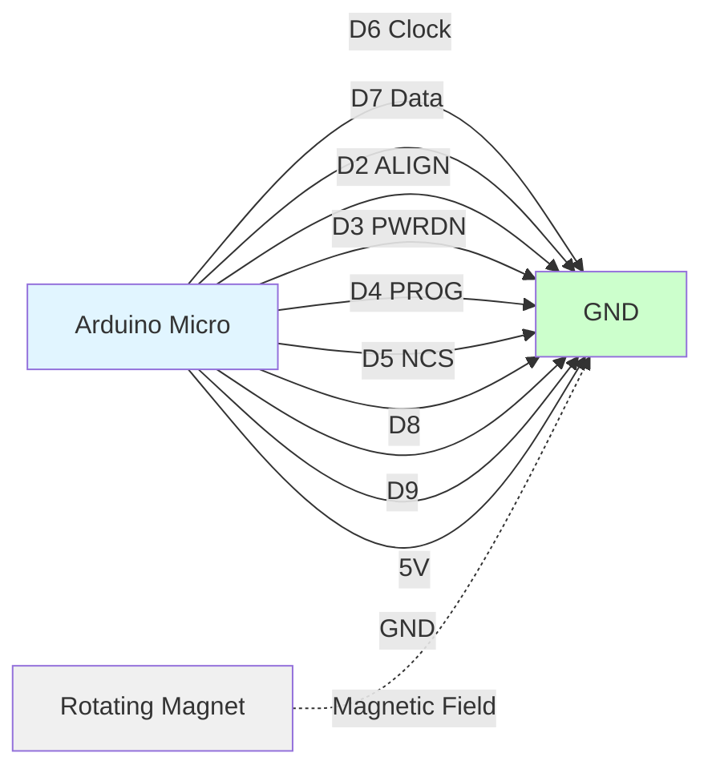
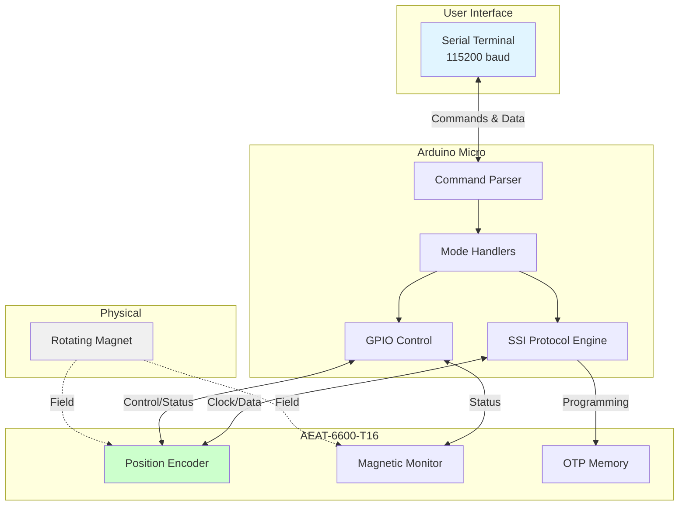

# AEAT-6600-T16 Encoder Interface

[](https://www.gnu.org/licenses/gpl-3.0)
[](CHANGELOG.md)
[](https://www.arduino.cc/)

> **Production-ready firmware for interfacing with the Broadcom AEAT-6600-T16 magnetic rotary encoder via SSI protocol**

## 🎯 Overview

The AEAT-6600-T16 Encoder Interface is a comprehensive, production-grade Arduino firmware that enables easy testing, configuration, and operation of the Broadcom AEAT-6600-T16 magnetic rotary encoder. This project provides a simple serial command interface for position reading, magnetic field monitoring, alignment testing, and encoder programming.

### Key Features

- ✅ **High-Speed Communication**: ~400kHz SSI clock rate using direct port manipulation
- ✅ **Real-Time Position Reading**: 10-bit resolution (0.35° precision)
- ✅ **Magnetic Field Monitoring**: Automated magnet positioning assistance
- ✅ **Alignment Testing**: Quality verification during installation
- ✅ **Programming Interface**: Safe OTP memory configuration
- ✅ **Production-Ready Code**: Comprehensive documentation, error handling, and testing
- ✅ **Extensive Documentation**: Architecture, hardware setup, API reference, and development guides

## 📊 Quick Start

### Hardware Requirements

- **Arduino Micro** (ATmega32U4 @ 16MHz)
- **AEAT-6600-T16** encoder chip
- **Permanent magnet** (diametrically magnetized, Ø6mm typical)
- **USB cable** (Micro-B)
- **Jumper wires** for connections

### Software Requirements

- Arduino IDE 1.8.x or 2.x (or VS Code with Arduino extension)
- USB drivers for Arduino Micro (usually automatic)

### Installation

```bash
# Clone the repository
git clone https://github.com/4nswer/AEAT-6600-T16.git
cd AEAT-6600-T16

# Open in Arduino IDE
# File -> Open -> AEAT-6600-T16.ino

# Select board: Tools -> Board -> Arduino Micro
# Select port: Tools -> Port -> (your Arduino port)

# Upload: Sketch -> Upload (Ctrl+U)
```

### Connection Diagram



### First Test

1. **Connect hardware** following the [Hardware Setup Guide](HARDWARE_SETUP.md)
2. **Open serial monitor** at 115200 baud
3. **Send command** `b` to check magnetic field
4. **Adjust magnet** until you see "OK: Magnetic field intensity is correct"
5. **Send command** `a` to read position
6. **Rotate shaft** and observe changing angles

## 📖 Documentation

### Complete Documentation Suite

| Document | Description |
|----------|-------------|
| **[README.md](README.md)** | This file - project overview and quick start |
| **[ARCHITECTURE.md](ARCHITECTURE.md)** | System architecture, data flow, and design decisions |
| **[HARDWARE_SETUP.md](HARDWARE_SETUP.md)** | Detailed hardware connection guide with diagrams |
| **[API_REFERENCE.md](API_REFERENCE.md)** | Complete command reference and usage examples |
| **[DEVELOPMENT.md](DEVELOPMENT.md)** | Developer guide for contributing and porting |
| **[CHANGELOG.md](CHANGELOG.md)** | Version history and release notes |

### System Architecture



## 🎮 Command Interface

### Available Commands

| Command | Mode | Description | Update Rate |
|---------|------|-------------|-------------|
| `a` | Position Read | Continuous angular position (0-360°) | 100 Hz (10ms) |
| `b` | Magnetic Check | Monitor field strength and positioning | 5 Hz (200ms) |
| `c` | Alignment Test | Check magnetic alignment quality | 10 Hz (100ms) |
| `d` | Programming | Write configuration to OTP memory | One-time |
| `e` | Exit | Return to idle mode | - |
| `h` | Help | Display command menu | - |

### Usage Examples

#### Example 1: Read Position

```
> a
>>> Entering Position Read Mode
>>> Press 'e' to exit
Position: 0.00°
Position: 15.23°
Position: 45.67°
Position: 90.12°
...
> e
>>> Returned to IDLE mode
```

#### Example 2: Check Magnetic Field

```
> b
>>> Entering Magnetic Field Check Mode
>>> Press 'e' to exit
WARNING: Magnetic field intensity is TOO LOW
[Move magnet closer...]
OK: Magnetic field intensity is correct. Position: 123.45°
OK: Magnetic field intensity is correct. Position: 123.56°
> e
```

#### Example 3: Test Alignment

```
> c
>>> Entering Alignment Test Mode
>>> Press 'e' to exit
Alignment Value: 450 (0x1C2)
Alignment Value: 448 (0x1C0)
> e
```

## 🔧 Pin Configuration

### Pin Assignments (Arduino Micro)

| Arduino Pin | Direction | Encoder Pin | Function | Notes |
|-------------|-----------|-------------|----------|-------|
| **D6** | OUTPUT | CLK (16) | SSI Clock | PORTD bit 7 - Critical timing |
| **D7** | INPUT/OUTPUT | DATA (15) | SSI Data | PORTE bit 6 - Bidirectional |
| **D2** | OUTPUT | ALIGN (12) | Alignment mode | HIGH = alignment active |
| **D3** | OUTPUT | PWRDN (13) | Power down | Not used in current version |
| **D4** | OUTPUT | PROG (11) | Programming mode | HIGH = OTP programming |
| **D5** | OUTPUT | NCS (14) | Chip select | Not used in current version |
| **D8** | INPUT | MAG_HI (10) | Field too high | Also OTP error indicator |
| **D9** | INPUT | MAG_LO (9) | Field too low | Also OTP prog status |
| **5V** | POWER | VDD (2,18) | Power supply | 4.5V - 5.5V |
| **GND** | GROUND | GND (1,17) | Ground | Connect all GND pins |

⚠️ **Important**: Pins D6 and D7 use direct port manipulation for performance. Changing pin assignments requires code modification.

## 🚀 Features in Detail

### Position Reading

- **Resolution**: 10-bit (1024 positions per revolution)
- **Output**: 0.00° to 359.99° (0.35° per step)
- **Precision**: 2 decimal places
- **Sample Rate**: Up to 17 kHz (limited by SSI protocol)
- **Latency**: ~60µs per read

### Magnetic Field Monitoring

The encoder provides real-time feedback on magnet positioning:

| Status | MAG_HI | MAG_LO | Action |
|--------|--------|--------|--------|
| ✅ **Optimal** | LOW | LOW | No action needed |
| ⚠️ **Too Strong** | HIGH | LOW | Increase air gap (move magnet away) |
| ⚠️ **Too Weak** | LOW | HIGH | Decrease air gap (move magnet closer) |
| ❌ **Fault** | HIGH | HIGH | Check wiring and encoder |

### Alignment Testing

Measures magnetic alignment quality for optimal performance:
- **Range**: 0 to 65535 (16-bit value)
- **Interpretation**: Lower values indicate better alignment
- **Typical Good Values**: < 1000 (varies by installation)

### OTP Programming

⚠️ **CRITICAL WARNING**: OTP (One-Time Programmable) memory writes are **PERMANENT and IRREVERSIBLE**.

- Configuration stored in non-volatile memory
- Survives power cycles
- Cannot be erased or rewritten
- Requires user confirmation before execution
- **Use with extreme caution**

## 🔬 Technical Specifications

### Performance Metrics

| Metric | Value |
|--------|-------|
| **SSI Clock Frequency** | ~400 kHz |
| **Position Sample Rate** | Up to 17 kHz |
| **Position Latency** | ~60 µs |
| **Angular Resolution** | 0.35° (10-bit) |
| **Output Precision** | 0.01° (2 decimal places) |
| **Serial Baud Rate** | 115200 |

### Memory Usage

| Resource | Usage | Available | Percentage |
|----------|-------|-----------|------------|
| **Flash (Program)** | ~8 KB | 28 KB | ~29% |
| **RAM (Dynamic)** | ~500 bytes | 2.5 KB | ~20% |
| **EEPROM** | 0 bytes | 1 KB | 0% |

### Power Consumption

| State | Current Draw |
|-------|--------------|
| **Active (Arduino + Encoder)** | ~55-75 mA |
| **Arduino Micro** | ~40-50 mA |
| **AEAT-6600-T16** | ~15-25 mA |

## 🛠️ Development

### Building from Source

**Prerequisites:**
- Arduino IDE 1.8.x or 2.x
- Arduino Micro board support

**Build Steps:**
```bash
# Clone repository
git clone https://github.com/4nswer/AEAT-6600-T16.git

# Open in Arduino IDE
# File -> Open -> AEAT-6600-T16.ino

# Verify/Compile
# Sketch -> Verify/Compile (Ctrl+R)

# Upload to board
# Sketch -> Upload (Ctrl+U)
```

### Code Structure

```
AEAT-6600-T16.ino
├── Configuration Namespaces
│   ├── HardwareConfig (Pin assignments)
│   ├── EncoderConfig (Encoder parameters)
│   ├── SerialConfig (Communication settings)
│   └── TimingConfig (SSI timing)
├── Type Definitions
│   ├── OperationMode enum
│   └── SystemState struct
├── Function Prototypes
├── setup() - Hardware initialization
├── loop() - Command dispatcher
├── Mode Handlers
│   ├── handlePositionMode()
│   ├── handleMagneticCheckMode()
│   ├── handleAlignmentTestMode()
│   └── handleProgrammingMode()
├── Encoder Interface
│   ├── readPosition()
│   ├── readAlignmentValue()
│   └── checkMagneticField()
├── SSI Protocol
│   ├── SSI_Shift_In()
│   └── SSI_Shift_Out()
└── Utilities
    ├── printMenu()
    └── flushSerialInput()
```

See [DEVELOPMENT.md](DEVELOPMENT.md) for detailed developer documentation.

## 🤝 Contributing

We welcome contributions! Please follow these steps:

1. **Fork** the repository
2. **Create** a feature branch (`git checkout -b feature/amazing-feature`)
3. **Commit** your changes (`git commit -m 'Add amazing feature'`)
4. **Push** to the branch (`git push origin feature/amazing-feature`)
5. **Open** a Pull Request

Please read [DEVELOPMENT.md](DEVELOPMENT.md) for coding standards and guidelines.

### Contributors

- **Andrew Becker** - Original Author
- **Community Contributors** - Thank you!

## 📋 Changelog

See [CHANGELOG.md](CHANGELOG.md) for version history and release notes.

## 📜 License

This project is licensed under the **GNU General Public License v3.0** - see the [LICENSE](LICENSE) file for details.

### What this means:
- ✅ You can use this software for any purpose
- ✅ You can modify the software
- ✅ You can distribute the software
- ✅ You can distribute modified versions
- ⚠️ You must disclose source code when distributing
- ⚠️ You must include the license and copyright
- ⚠️ You must state changes made
- ⚠️ You must use the same license (GPL-3.0)

## 🙏 Acknowledgments

- Original discussion and inspiration from [Arduino Forum](http://forum.arduino.cc/index.php?topic=156812.0)
- Broadcom for the AEAT-6600-T16 encoder chip and excellent documentation
- Arduino community for the development platform

## 📚 Resources

### Documentation

- **Encoder Datasheet**: [AV02-2792EN](https://docs.broadcom.com/doc/AV02-2792EN)
- **Application Notes**: [AV02-2791EN](https://docs.broadcom.com/wcs-public/products/application-notes/application-note/696/604/av02-2791en_an_5501_aeat-6600_2014-04-21.pdf)
- **Arduino Micro**: [Official Page](https://www.arduino.cc/en/Main/Arduino_BoardMicro)

### Support

- **Issues**: Report bugs or request features on [GitHub Issues](https://github.com/4nswer/AEAT-6600-T16/issues)
- **Discussions**: Ask questions on [GitHub Discussions](https://github.com/4nswer/AEAT-6600-T16/discussions)
- **Arduino Forum**: General Arduino help at [forum.arduino.cc](https://forum.arduino.cc/)

## 🎯 Roadmap

### Version 2.x (Current)
- [x] Production-ready code refactor
- [x] Comprehensive documentation
- [x] Error handling and validation
- [x] Mermaid.js diagrams
- [x] Extensive inline documentation

### Version 3.x (Future)
- [ ] Multiple encoder support
- [ ] Data logging to SD card
- [ ] Web interface via WiFi module
- [ ] CAN bus interface option
- [ ] Interrupt-driven sampling
- [ ] Advanced filtering algorithms

## ⚡ Performance Tips

### Maximizing Sample Rate

1. **Use position mode** (`a`) for fastest continuous reading
2. **Minimize serial output** - Reading is much faster than printing
3. **Disable other serial debug** messages
4. **Consider interrupt-driven** reading (see DEVELOPMENT.md)

### Improving Accuracy

1. **Stable power supply** - Use quality USB cable and port
2. **Minimize magnetic interference** - Keep away from motors/magnets
3. **Secure mechanical mounting** - Prevent vibration
4. **Optimize air gap** - 0.5mm - 2mm typically optimal
5. **Center magnet** precisely over encoder chip

## 🆘 Troubleshooting

### Common Issues

| Problem | Solution |
|---------|----------|
| No serial output | Check baud rate (115200), USB cable, drivers |
| "Field TOO HIGH" | Move magnet further from encoder |
| "Field TOO LOW" | Move magnet closer to encoder |
| Position not changing | Check D6/D7 connections, verify wiring |
| Erratic readings | Add bypass capacitors, check grounds |

See [HARDWARE_SETUP.md](HARDWARE_SETUP.md) for detailed troubleshooting guide.

## 📞 Contact

**Project Repository**: [https://github.com/4nswer/AEAT-6600-T16](https://github.com/4nswer/AEAT-6600-T16)

**Author**: Andrew Becker

---

**Made with ❤️ for the Arduino and encoder community**

**⭐ If this project helped you, please star it on GitHub! ⭐**
